# Java基础
## 面向对象和面向过程有什么区别
一、 面向对象
1、面向对象以对象为中心。先把要完成的功能封装成一个一个的对象，通过调用对象的方法或属性来完成功能。

2、优点：不仅关注眼前的事件实现，也关注未来可能发生的事件。具有高度的拓展性和复用性，特点是继承、封装、多肽。

3、缺点：如果只是单一的功能实现，面向对象的设计思路会过于繁琐。

二、 面向过程
1、面向过程是以事件为中心，按照我们编写的代码是根据完成一个步骤的过程来进行。

2、优点：根据事情的目的分解出过程，再一步步实施。对于不复杂的事件执行效率快。

3、缺点：只关注眼前事件的实现。
# 注解
## 内置注解：
Supresswarning，
deprecated，
override
## 元注解
元注解即为注解的注解
@Target：表示注解可以用在哪些地方(方法，类，变量.....)

@Retention:表示注解在什么阶段有效(source:源码阶段，class:编译阶段，runtime：运行阶段)，作用范围runtime > class > source

@Document：表示是否将注解生成在javadoc中

@Inherited：表示子类可以继承父类的注解
## 注解的参数
注解的参数：参数类型 + 参数名（），如
```
@interface MyAnnotation{
    String name(); //参数类型为String，参数名为name
    int age() default 0; //参数类型为int，参数名为age,默认值为0
    int id() default -1; //参数类型为int，参数名为id,默认值为-1,代表不存在
    String[] like(); //参数类型为String数组，参数名为like
}
```
# 反射
## 使用反射的一些例子

1.Spring/Springboot等框架大量使用动态代理，**动态代理依赖于反射机制**。

2.注解也使用了反射


## 获取Class类实例的几个方式：
1.若已知具体的类，则通过该类的class属性获取
```
Class cla = Person.class;
```
2.已经某个类的实例，通过该实例的getClass()方法获取
```
Class cla = person.getClass();
```
3.已经一个类的全类名以及它的包路径，通过Class类的静态方法forName(String className)获取
```
Class cla = Class.forName("com.company.Person");
```
4.通过类加载器获取
5.内置类型的包装类（Integer等）可以直接使用类名.Type

## 反射使用实践
1.创建需要反射的类
```java
package com.cytus.learnspb.exercises;

/*
* 反射需要使用的目标类
* */
public class TargetObject {
    private String value;
    public TargetObject()
    {
        value = "反射目标类";
    }
    public void publicMethod(String s)
    {
        System.out.println("one public method:"+s);
    }
    private void privateMethod(String s) {
        System.out.println("one private method:" + s);
    }
}

```
2.反射使用该类
```java
package com.cytus.learnspb.exercises;

import java.lang.reflect.Field;
import java.lang.reflect.InvocationTargetException;
import java.lang.reflect.Method;

/*
* 练习反射
* */
public class InvocationLearn {
    // 使用反射操作TargetObject的方法和参数

    public static void main(String[] args) throws ClassNotFoundException, NoSuchMethodException, InstantiationException, IllegalAccessException, InvocationTargetException, NoSuchFieldException {
        /*
        * 1.获取TargetObject类的class对象，再为对象创建TargetObject实例
        * 这里理解为:获取对象实际上获取的是TargetObject这个类的元信息对象(即Class的对象class)
        * 然后通过元对象(class)的newInstance()方法创建TargetObject的实例
        * */
        // 通过类名的全路径加载，四种获得class对象的方式？
        Class<?> targetClass = Class.forName("com.cytus.learnspb.exercises.TargetObject");
        TargetObject targetObject = (TargetObject) targetClass.newInstance();

        /*
        * 获取TargetObject中的所有方法
        * */
        Method[] methods = targetClass.getDeclaredMethods();
        // 打印所有方法名查看
        for(Method method:methods)
        {
            System.out.println(method.getName());
        }

        /*
        * 获取指定方法并调用
        * 寻找方法时当然需要方法名和参数类型
        * */
        Method publicMethod = targetClass.getDeclaredMethod("publicMethod", String.class);
        // invoke()调用方法，传入对象和方法的参数
        publicMethod.invoke(targetObject,"反射调用方法"); // 用invoke调用对象的方法(为什么不能直接调用呢？)

        /*
        * 获取类中的指定参数并进行修改, Declared开头会获取所有，否则就只有公共的
        * */
        Field field = targetClass.getDeclaredField("value");
        field.setAccessible(true); // 设置可访问权限
        field.set(targetObject, "JavaGuide"); // 传入对象和值作为参数

        /*
        * 获得private参数并调用，多了setAccessible而已
        * */
        Method privateMethod = targetClass.getDeclaredMethod("privateMethod", String.class);
        // invoke()调用方法，传入对象和方法的参数
        privateMethod.setAccessible(true);
        privateMethod.invoke(targetObject,"反射调用私有方法"); // 用invoke调用对象的方法(为什么不能直接调用呢？)
    }
}

```
## 类的加载与初始化
加载：将class文件字节码内容加载到内存中，并将这些静态数据转换成方法区的运行时数据结构，然后**生成一个代表这个类的java.lang.Class对象**

链接：
（1）.验证：确保加载的类信息符合JVM规范，没有安全方面问题
（2）.准备：为类的**静态变量**分配内存，并将其**初始化为默认值**
（3）.解析：将虚拟机常量池中的符号引用（常量名）转换为直接引用（地址）
初始化：
（1）.执行类构造器**clinit**()方法的过程，类构造器**clinit**()方法是由编译期自动收集类中所有类变量的赋值动作和静态代码块中的语句合并产生的。（类构造器是构造类信息的，不是构造该类对象的构造器）
（2）.当初始化一个类时，如果其父类还未初始化，那么会先触发父类的初始化
（3）.虚拟机保证了**cinit**方法能在多线程环境下被正确加锁和同步

### 反射动态创建对象
```
获得class对象：class对象
Class cla = Class.forName("com.company.Person");
//创建对象
Person person = (Person)cla.newInstance();
//传入参数获取对应构造器
Constructor con = cla.getDeclaredConstructor(String.class,int.class);
//通过构造器创建对象
Person person = (Person)con.newInstance()
```
### 反射调用方法
```
//通过反射调用普通方法
User user3 = (User)cla.newInstance();
//通过反射获取一个方法
Method setName = c1a.getDeclaredMethod("setName",String.class);
//通过反射调用方法
setName.invoke(user3,"张三");
```
### 反射操作属性
```
User user4 = (User)cla.newInstance();
//通过反射获取一个属性
Field name = cla.getDeclaredField("name");
//取消属性的访问检查(如果这个属性被设置为私有的)
name.setAccessible(true);
name.set(user4,"张三");
```

## 通过反射操作注解
先自定义一个注解
```
//表名的注解
@Target(ElementType.TYPE)
@Retention(RetentionPolicy.RUNTIME)
public @interface Table {
    String value();
}
```
```
//属性名的注解
@Target(ElementType.FIELD)
@Retention(RetentionPolicy.RUNTIME)
public @interface Field {
    String colunmName();
    String name();
    int length();
}
```
```
//定义一张表
@Tbale("tb_student")
public class Student{
    @Field(colunmName="id",length=10,type="int")
    private int id;
    @Field(colunmName="name",length=255,type="varchar")
    private String name;
    @Field(colunmName="age",length=10,type="int")
    private int age;
    .......
}
```
```
//通过反射获取注解
Class cla = Class.forName("com.company.Student");
Annotation[] annotations = cla.getAnnotations();
for (Annotation annotation : annotations) {
    System.out.println(annotation);
}
//获得注解对应value的值
Annotation annotation = cla.getAnnotation(Table.class);
Table table = (Table)annotation;
String value = table.value();
System.out.println(value);

//获得类指定的注解
Field field = cla.getDeclaredField("id");
Field annotation1 = field.getAnnotation(Field.class);
System.out.println(annotation1.colunmName());// 打印id
System.out.println(annotation1.length());// 打印10
System.out.println(annotation1.type()); // 打印 int
```

## 设计模式
### 代理模式

代理是一种设计模式，使用代理对象代替**真实对象**（real object）的访问，在不修改原目标对象的前提下，提供额外的功能操作。主要作用是**扩展目标目标对象的功能**。

感觉也可以叫做**装饰器模式**。

#### 静态代理
静态代理是通过在工具类中持有**目标类实例**，并通过工具类调用相关方法来实现在原有业务流程上添加功能

**静态代理步骤**：
1.定义一个接口及其实现类（target object）（实际上直接继承实现类也是可以的，不一定需要接口类）
2.创建一个代理类也实现这个接口（通过接口可以实现多态）
3.将目标对象注入进代理类，然后调用的都是代理类增强过的方法。

**缺点**：
1.不灵活，每个target类都要手动增强，写代理类
2.静态代理在编译时就将接口、实现类、代理类变成了一个个class文件

**实践**：

```java
原有类
package com.lijie;

//接口类
public class UserDao{
	public void save() {
		System.out.println("保存数据方法");
	}
}
package com.lijie;

//运行测试类
public  class Test{
	public static void main(String[] args) {
		UserDao userDao = new UserDao();
		userDao.save();
	}
}
```
如果想要在save之前开启事务，在save之后关闭事务，在不影响原有业务流程的情况下，启用静态代理
```java
package com.lijie;

//代理类
public class UserDaoProxy extends UserDao {
	private UserDao userDao;

	public UserDaoProxy(UserDao userDao) {
		this.userDao = userDao;
	}

	public void save() {
		System.out.println("开启事物...");
		userDao.save();
		System.out.println("关闭事物...");
	}

}

//添加完静态代理的测试类
public class Test{
	public static void main(String[] args) {
		UserDao userDao = new UserDao();
		UserDaoProxy userDaoProxy = new UserDaoProxy(userDao);
		userDaoProxy.save();
	}
}
```

#### 动态代理
静态代理的问题在于**每个被代理类**都需要编写自己的代理类，会显得代码冗余
因此采用动态代理的方式，使用**反射**创建代理对象和调用方法

在实际开发忠使用动态代理，目的是为了对**多个**方法添加**统一**的逻辑增强，并且不对原来吗做入侵。

SpringAOP 和RPC框架都依赖了动态代理

Java常见额动态代理方式有：**JDK动态代理、CGLIB动态代理**

#### JDK动态代理

jdk动态代理只能代理接口和实现类是因为：`newProxyInstance()`创建的代理类实例必须要用**原始类型接收**（因为代理对象的目标类型是位置的），

但是又继承了`Proxy`，因此只能实现一个接口，通过接口实现多态。（通过查看生成的代理类文件更清晰）


```java
package com.lijie;

//接口
public interface UserDao {
    void save();
}
```

```java
package com.lijie;

//接口实现类
public class UserDaoImpl implements UserDao {
	public void save() {
		System.out.println("保存数据方法");
	}
}
```

----
通过在invocationHandler中的invoke中写增强方法，相当于可以用于**多个不同类型的target**，而如果是静态代理则需要手动写多个不同target的代理对象。（相当于自动生成了代理对象那个）
代理接口：
```java
package com.lijie;

import java.lang.reflect.InvocationHandler;
import java.lang.reflect.Method;

// 每次生成动态代理类对象时,实现了InvocationHandler接口的调用处理器对象
public class InvocationHandlerImpl implements InvocationHandler {

	// 这其实业务实现类对象，用来调用具体的业务方法
    private Object target;

    // 通过构造函数传入目标对象
    public InvocationHandlerImpl(Object target) {
        this.target = target;
    }

    //动态代理实际运行的代理方法
    public Object invoke(Object proxy, Method method, Object[] args) throws Throwable {
        System.out.println("调用开始处理");
        //下面invoke()方法是以反射的方式来创建对象，第一个参数是要创建的对象，第二个是构成方法的参数，由第二个参数来决定创建对象使用哪个构造方法
		Object result = method.invoke(target, args);
        System.out.println("调用结束处理");
        return result;
    }
}
```

使用动态代理调用方法：
```java
package com.lijie;

import java.lang.reflect.Proxy;

public class Test {
    public static void main(String[] args) {
        // 被代理对象
        UserDao userDaoImpl = new UserDaoImpl();
        InvocationHandlerImpl invocationHandlerImpl = new InvocationHandlerImpl(userDaoImpl);

        //类加载器
        ClassLoader loader = userDaoImpl.getClass().getClassLoader();
        Class<?>[] interfaces = userDaoImpl.getClass().getInterfaces();

        // 主要装载器、一组接口及调用处理动态代理实例
        UserDao newProxyInstance = (UserDao) Proxy.newProxyInstance(loader, interfaces, invocationHandlerImpl);
        newProxyInstance.save();
    }
}
```
在此例中，通过InvocationHandlerImpl实现了一个UserDaoImpl的接口处理对象（UserDaoImpl是UserDao的实现类）

之后通过Proxy.newProxyInstance生成一个代理类newProxyInstance，在调用newProxyInstance.save()的时候，实际上会调用 InvocationHandlerImpl 中的 invoke() 方法来处理 save() 方法的调用。实际上是通过反射调用了UserDaoImpl的save方法

动态代理是**面向接口**的，必须有接口的实现类（错）
也可以直接代理接口

。因为Proxy会生成一个UserDao的代理类，这个类继承了Proxy，而java是单继承的，所以只能通过实现接口的方式。实现接口的目的是为了持有接口/类的方法，用于重写
```
public final class $Proxy0 extends Proxy implements UserService { //$Proxy0是生成的代理类
    private static Method m1;
    private static Method m3;
    private static Method m2;
    private static Method m0;

    public $Proxy0(InvocationHandler var1) throws  {
        super(var1);
    }

    public final boolean equals(Object var1) throws  {
        try {
            return (Boolean)super.h.invoke(this, m1, new Object[]{var1});
        } catch (RuntimeException | Error var3) {
            throw var3;
        } catch (Throwable var4) {
            throw new UndeclaredThrowableException(var4);
        }
    }

    public final int sava() throws  { //重写的方法
        try {
            return (Integer)super.h.invoke(this, m3, (Object[])null); //$proxy0继承了Proxy，super.h也即实现增强功能的InnovationHandler，调用了其invoke方法
        } catch (RuntimeException | Error var2) {
            throw var2;
        } catch (Throwable var3) {
            throw new UndeclaredThrowableException(var3);
        }
    }

    public final String toString() throws  {
        try {
            return (String)super.h.invoke(this, m2, (Object[])null);
        } catch (RuntimeException | Error var2) {
            throw var2;
        } catch (Throwable var3) {
            throw new UndeclaredThrowableException(var3);
        }
    }

    public final int hashCode() throws  {
        try {
            return (Integer)super.h.invoke(this, m0, (Object[])null);
        } catch (RuntimeException | Error var2) {
            throw var2;
        } catch (Throwable var3) {
            throw new UndeclaredThrowableException(var3);
        }
    }

    static {
        try {
            m1 = Class.forName("java.lang.Object").getMethod("equals", Class.forName("java.lang.Object"));
            m3 = Class.forName("com.tiantang.study.UserService").getMethod("sava");
            m2 = Class.forName("java.lang.Object").getMethod("toString");
            m0 = Class.forName("java.lang.Object").getMethod("hashCode");
        } catch (NoSuchMethodException var2) {
            throw new NoSuchMethodError(var2.getMessage());
        } catch (ClassNotFoundException var3) {
            throw new NoClassDefFoundError(var3.getMessage());
        }
    }
}
```
#### CGLIB动态代理

CGLIB动态代理原理：

利用asm开源包，对代理对象类的class文件加载进来，通过修改其字节码生成子类来处理。（没有继承Proxy类这一部分，然后改成了继承target类，其他和jdk动态代理比较类似）


CGLIB动态代理和jdk代理一样，使用反射完成代理，不同的是他可**以直接代理类**（jdk动态代理不行，他要求目标业务类必须实现接口），CGLIB动态代理底层使用字节码技术，CGLIB动态代理不能对 **final类进行继承**。（CGLIB动态代理需要导入jar包）

```java
package com.lijie;
import org.springframework.cglib.proxy.Enhancer;
import org.springframework.cglib.proxy.MethodInterceptor;
import org.springframework.cglib.proxy.MethodProxy;
import java.lang.reflect.Method;

//接口
public interface UserDao {
    void save();
}


//接口实现类
public class UserDaoImpl implements UserDao {
	public void save() {
		System.out.println("保存数据方法");
	}
}
```
-----
实现`MethodInterceptor`接口，其作用和`InvocationHandler`类似
```java
public class CglibProxy implements MethodInterceptor {
	private Object targetObject;
	// 这里的目标类型为Object，则可以接受任意一种参数作为被代理类，实现了动态代理
	public Object getInstance(Object target) {
		// 设置需要创建子类的类
		this.targetObject = target;
		Enhancer enhancer = new Enhancer();
		enhancer.setSuperclass(target.getClass());
		enhancer.setCallback(this);
		return enhancer.create();
	}

	//代理实际方法
	public Object intercept(Object obj, Method method, Object[] args, MethodProxy proxy) throws Throwable {
		System.out.println("开启事物");
		Object result = proxy.invoke(targetObject, args);
		System.out.println("关闭事物");
		// 返回代理对象
		return result;
	}
}

public class Test {
    public static void main(String[] args) {
        CglibProxy cglibProxy = new CglibProxy();
        UserDao userDao = (UserDao) cglibProxy.getInstance(new UserDaoImpl());
        userDao.save();
    }
}

```
### springAOP中的动态代理
JDK 动态代理：**对于实现了接口的目标类**，Spring AOP 默认使用 JDK 的 java.lang.reflect.Proxy 类来创建代理对象。代理对象会在运行时实现代理接口，并覆盖其中的方法，在方法调用前后执行切面逻辑（即通知，advice）。

CGLIB 动态代理：**对于未实现接口的类**，Spring AOP 会选择使用 CGLIB 库来生成代理对象。CGLIB 通过字节码技术创建目标类的子类，在子类中重写目标方法并在方法调用前后插入切面逻辑。


### 模板模式
模板模式在父类中预先定义了一些行为，还有一些行为未定义交由子类实现，子类在实现自己的方法后通过调用相关接口就可以执行父类预定义行为+自己定义的行为
```
public abstract class RestaurantTemplate {

	// 1.看菜单
	public void menu() {
		System.out.println("看菜单");
	}

	// 2.点菜业务
	abstract void spotMenu();

	// 3.吃饭业务
	public void havingDinner(){ System.out.println("吃饭"); }

	// 3.付款业务
	abstract void payment();

	// 3.走人
	public void GoR() { System.out.println("走人"); }

	//模板通用结构
	public void process(){
		menu();
		spotMenu();
		havingDinner();
		payment();
		GoR();
	}
}

public class RestaurantGinsengImpl extends RestaurantTemplate {

    void spotMenu() {
        System.out.println("人参");
    }

    void payment() {
        System.out.println("5快");
    }
}

public class RestaurantLobsterImpl  extends RestaurantTemplate  {

    void spotMenu() {
        System.out.println("龙虾");
    }

    void payment() {
        System.out.println("50块");
    }
}

public class Client {

    public static void main(String[] args) {
        //调用第一个模板实例
        RestaurantTemplate restaurantTemplate = new RestaurantGinsengImpl();
        restaurantTemplate.process();
    }
}
```
### 单例模式
```
class Singleton01{
    private static Singleton01 instance;
    private Singleton01(){}

    public static Singleton01 getInstance(){
        if(null != instance){
            return instance;
        }
        instance = new Singleton01();
        return instance;
    }
}//这种在多线程情况下是不行的
PS:在执行instance = new Singleton01();的时候内存发生的变化：
1.为Singleton01对象在堆上分配内存空间
2.执行Singleton01的构造函数，如果此时还未进行类加载，会先进行类的加载
3.将instance指向新创建的对象


class Singleton03{
    private Singleton03(){}
    private static Singleton03 instance = new Singleton03();

    public Singleton03 getInstance(){
        return instance;
    }
}//饿汉式，会预先创建一个实例。但是这种方式可能会造成浪费，因为只要类加载了就会产生实例化对象

//以下三种都是懒汉式
class Singleton02{
    private Singleton02 instance;
    private Singleton02(){}

    public synchronized Singleton02 getInstance(){
        if(null != instance){
            return instance;
        }
        instance = new Singleton02();
        return instance;
    }
}//在高并发的情况下会导致性能降低

class Singleton05{
    private Singleton05 instance;
    private Singleton05(){}

    public Singleton05 getInstance(){
        if(null != instance){
            return instance;
        }
        synchronized (Singleton05.class){
            if(null != instance){
                return instance;
            }
            instance = new Singleton05();
            return instance;
        }
    }
}
通过内部类持有实例的形式，避免了只要Sington04类加载后就会产生实例化对象，因为只有调用内部类方法的时候内部类才会进行加载和初始化，这时才会产生一个实例化对象
class Singleton04{
    private Singleton04(){}

    class instanceHolder{
        private static Singleton04 instance = new Singleton04();
    }
    public Singleton04 getInstance(){
        return instanceHolder.instance;
    }
}
```
### 装饰器模式
装饰器模式可以在不改变一个对象本身功能的基础上给对象增加额外的新行为。装饰器模式与代理模式类似，也是通过持有被装饰类的对象实例来添加新的功能。因为要调用原有接口，装饰类和被装饰类需要实现同一个接口
```
public interface Drink {
    /**
     * 喝水
     */
    void drink();
}
public class DrinkWater implements Drink {

    @Override
    public void drink() {
        System.out.println("喝水");
    }

}
public class DrinkDecorator implements Drink {

    private final Drink drink;

    public DrinkDecorator(Drink drink) {
        this.drink = drink;
    }

    @Override
    public void drink() {
        System.out.println("先加点儿柠檬片");
        drink.drink();
    }

}
public class DrinkMain {
    public static void main(String[] args) {
        Drink drink = new DrinkWater();
        drink = new DrinkDecorator(drink);
        drink.drink();
    }
}
```
装饰旨在增强原有类的功能，因此可以有多级装饰，而代理模式一般只有一级
多级装饰的例子
```
public interface MilkyTea {
    double cost();
}

public class PearlMilkyTea implements MilkyTea{
    @Override
    public double cost() {
        return 13.0;
    }
}

public abstract class MilkyTeaDecorator implements MilkyTea{

    private MilkyTea milkyTea;

    public MilkyTeaDecorator(MilkyTea milkyTea){
        this.milkyTea = milkyTea;
    }

    @Override
    public double cost() {
        return milkyTea.cost();
    }
}

//椰果奶茶
public class CoconutDecorator extends MilkyTeaDecorator{

    public CoconutDecorator(MilkyTea milkyTea) {
        super(milkyTea);
    }

    @Override
    public double cost() {
        System.out.println("添加椰果");
        return super.cost() + 2.0;
    }
}


/**
 * 布丁奶茶
 */
public class PuddingDecorator extends MilkyTeaDecorator{

    public PuddingDecorator(MilkyTea milkyTea) {
        super(milkyTea);
    }

    @Override
    public double cost() {
        System.out.println("添加布丁");
        return super.cost() + 1.5;
    }
}

public class Client {
    public static void main(String[] args) {
        MilkyTea milkyTea = new PearlMilkyTea();
        milkyTea = new CoconutDecorator(milkyTea);
        milkyTea = new PuddingDecorator(milkyTea);
        System.out.println(milkyTea.cost());
    }
}

运行结果：
添加布丁
添加椰果
16.5
```
### 适配器模式
适配器模式的作用就是连接现有程序和所需程序。其中**类适配模式是通过继承的方式，对象适配的模式是通过持有被适配类的对象**(对象适配模式比较像装饰器模式)
类适配模式：
```
public class Adaptee {
    /**
     * 需要被适配的功能
     * 这里用插座转换举例
     */
    public void commonThreeHoleSocket(){
        System.out.println("hi，我是一个常见的三孔插座");
    }
}

public interface Target {
    /**
     * 定义新插座的规范是新插座的形状应该是一个双头插座
     */
    public void doubleHoleSocket();
}

public class Adapter extends Adaptee implements Target {

    /**
     * 采用继承的方式实现转换功能
     */
    @Override
    public void doubleHoleSocket() {
        // 调用继承的方法，对其进行增强或处理
        this.commonThreeHoleSocket();
        System.out.println("==========开始转换==========");
        System.out.println("oh，我变成了两孔插座");
    }
}

public class Client {
    public static void main(String[] args) {
        Target newPlug = new Adapter();
        // 对于使用者来说，它只需要知道适配器提供了一个两孔插头即可
        newPlug.doubleHoleSocket();
        System.out.println("这是一个两孔插头");
    }
}
```
对象适配器模式(通过持有对象)：
```
public class Adapter implements Target {
    /**
     * 这是两种实现方式唯一的不同之处
     */
    private Adaptee adaptee;

    public Adapter() {
        this.adaptee = new Adaptee();
    }

    /**
     * 采用组合的方式实现转换功能
     */
    public void doubleHoleSocket() {
        // 调用组合成员的方法，对其进行增强或处理
        this.adaptee.commonThreeHoleSocket();
        System.out.println("==========开始转换==========");
        System.out.println("oh，我变成了两孔插座");
    }
}
```
适配器模式和装饰器模式的区别在于，适配器模式是在适配器类调用与被适配类不同的方法(要适配的Target接口)，装饰器模式是在装饰类里调用与被装饰类相同的方法以达到增强的目的。
### 原型模式
原型模式是指通过深拷贝的方式创建一个重复的对象，这种模式是实现了一个原型接口，该接口用于创建当前对象的克隆。当直接创建对象的代价比较大时，则采用这种模式。
# Java并发

## 锁
### voliate
voliate关键字可以使得变量对所有的线程都可见，但不具备原子性，不能保证变量操作的原子性。voliate关键字可以通过插入特定的内存屏障的方式来禁止指令重排序，voliate只能用于变量，它可以看作是进程同步的轻量级实现

voliate 关键字用于修饰变量时，能够保证该变量的可见性和有序性。关于有序性，voliate 通过内存屏障的插入来实现：

写内存屏障（Store Barrier / Write Barrier）： 当线程写入 voliate 变量时，JMM 会在写操作前插入 StoreStore 屏障，确保在这次写操作之前的所有普通写操作都已完成。接着在写操作后插入 StoreLoad 屏障，强制所有后来的读写操作都在此次写操作完成之后执行，这就确保了其他线程能立即看到 voliate 变量的最新值。
读内存屏障（Load Barrier / Read Barrier）： 当线程读取 voliate 变量时，JMM 会在读操作前插入 LoadLoad 屏障，确保在此次读操作之前的所有读操作都已完成。而在读操作后插入 LoadStore 屏障，防止在此次读操作之后的写操作被重排序到读操作之前，这样就确保了对 voliate 变量的读取总是能看到之前对同一变量或其他相关变量的写入结果。

其中，**在写操作之后加入写屏障，可以保证存储队列里的消息全部被写入到对方cpu的失效队列中，读操作之前加入读屏障，可以保证失效队列中的消息都被消费完**，详见OS-MESI协议部分

关于可见性，voliate 内存可见性主要通过 lock 前缀指令实现的，它会锁定当前内存区域的缓存（缓存行），并且立即将当前缓存行数据写入主内存（耗时非常短），回写主内存的时候会通过 MESI 协议使其他线程缓存了该变量的地址失效，从而导致其他线程需要重新去主内存中重新读取数据到其工作线程中。

#### 内存屏障
锁定（lock）: 作用于主内存中的变量，将他标记为一个线程独享变量。

解锁（unlock）: 作用于主内存中的变量，解除变量的锁定状态，被解除锁定状态的变量才能被其他线程锁定。

read（读取）：作用于主内存的变量，它把一个变量的值从主内存传输到线程的工作内存中，以便随后的 load 动作使用。

load(载入)：把 read 操作从主内存中得到的变量值放入工作内存的变量的副本中。

use(使用)：把工作内存中的一个变量的值传给执行引擎，每当虚拟机遇到一个使用到变量的指令时都会使用该指令。

assign（赋值）：作用于工作内存的变量，它把一个从执行引擎接收到的值赋给工作内存的变量，每当虚拟机遇到一个给变量赋值的字节码指令时执行这个操作。

store（存储）：作用于工作内存的变量，它把工作内存中一个变量的值传送到主内存中，以便随后的 write 操作使用。

write（写入）：作用于主内存的变量，它把 store 操作从工作内存中得到的变量的值放入主内存的变量中。

### JMM
JMM定义了并发编程的规范，保证多线程情况下对于线程共享变量的可见性。其中最重要的是happens-before原则，如果一个操作A happens-before操作B，那么A的结果对于B而言一定是可见的，即使是在多线程的情况下。比如volatile变量的happens-before原则：volatile修饰的变量的写操作happens-before读操作，那么写操作对于其之后的读操作一定是可见的。还有一些额外的happens-before原则：
程序顺序规则：一个线程内，按照代码顺序，书写在前面的操作 happens-before 于书写在后面的操作；
解锁规则：解锁 happens-before 于加锁；
传递规则：如果 A happens-before B，且 B happens-before C，那么 A happens-before C；
线程启动规则：Thread 对象的 start()方法 happens-before 于此线程的每一个动作。

总体来说，JMM是一组比较抽象化的可见性规范

### 乐观锁
乐观锁：每次假设最好的情况，线程可以不停的执行，无需加锁也无需等待。具体的实现方法有CAS算法和版本号算法，CAS算法会有一个要更新的值V,预期值E,拟写入的新值N，只有当V==E时才会写入新值，否则放弃更新，因为V != E时说明有其他线程修改过了，因此不应该再执行更新。但是仍然存在ABA问题，并且CAS的自旋操作也会给cpu带来负担。ABA的解决方法有加版本号或者时间戳

### 悲观锁
悲观锁：每次都假设最坏的情况，线程在进行操作前必须上锁，具体的实现方法有synchronized和ReentrantLock。在高并发的情况下，激烈的锁竞争会导致大量线程阻塞，线程阻塞会带来大量线程上下文切换，增加系统的性能开销。

### synchronized
synchronized：被其修饰的方法或代码块同一时间只有一个线程能运行。当其修饰的位置不同，其锁住的对象也不同：
当其作用在实例方法上：锁住的是对象实例
当其作用在静态方法上：锁住的是当前类
当其作用在代码块上：锁住的是对应的对象或者类
```
synchronized void method() {
    //业务代码
}

synchronized static void method() {
    //业务代码
}

synchronized(this) {
    //业务代码
}synchronized(object) 表示进入同步代码库前要获得 给定对象的锁。
synchronized(类.class) 表示进入同步代码前要获得 给定 Class 的锁

```
synchronized底层：每个锁都有一个monitor对象。在修饰代码块的时候，synchronized通过monitorenter和monitorexit实现，在进入先执行monitorenter获得锁，执行完毕后通过monitorexit释放锁，如果获取锁失败则会阻塞等待
在修饰方法的时候，synchronized 修饰的方法并没有 monitorenter 指令和 monitorexit 指令，取得代之的确实是 ACC_SYNCHRONIZED 标识，该标识指明了该方法是一个同步方法，从而进行相应的同步调用

jdk1.6以后，synchronized有四种状态：
1.无锁：对共享资源不加锁

2.偏向锁，**共享资源第一次被访问时**，JVM会对其做一些设置，比如将资源对象头偏向锁设置为1，线程号改为当前线程，当后续该线程再次访问到共享资源时，会比较其偏向锁和线程号，如果与当前线程相同则可以获得资源

3.轻量级锁，当多个进程对共享资源竞争时，JVM会先尝试用轻量级锁，会先尝试用CAS的方式获取锁，如果能够获取那么此时状态为轻量级锁，**如果CAS失败太多次（自旋），那么会升级为重量级锁**

4.重量级锁，当资源已经被线程占有，此时为偏向锁或者轻量级锁状态，此时再有其他进程来竞争，那么会升级为重量级锁，**重量级锁由操作系统实现，开销比较高**

### ReentrantLock
ReentrantLock：与synchronized类似，也是一个可重入且独占的锁，只不过它实现公平锁（先来的进程先获得锁），而synchronized只有非公平锁；它可以实现中断等待锁，使得等待锁的进程可以放弃等待去做其他事情，这个是通过lock.lockInterruptibly来实现；它可以用Condition接口和newCondition()方法来实现选择性通知
ReentrantLock实现可重入的原理与AQS有关（ReentrantLock本来就是基于AQS的同步器），
ReentrantLock的内部维护了一个 state 变量，用来表示锁的占用状态。state 的初始值为 0，表示锁处于未锁定状态。当线程 A 调用 lock() 方法时，会尝试通过 tryAcquire() 方法独占该锁，并让 state 的值加 1。如果成功了，那么线程 A 就获取到了锁。如果失败了，那么线程 A 就会被加入到一个等待队列（CLH 队列）中，直到其他线程释放该锁。假设线程 A 获取锁成功了，**释放锁之前，A 线程自己是可以重复获取此锁的（state 会累加）**。这就是可重入性的体现：一个线程可以多次获取同一个锁而不会被阻塞。但是，这也意味着，一个线程必须释放与获取的次数相同的锁，才能让 state 的值回到 0，也就是让锁恢复到未锁定状态。
### synchronized 和 volatile区别
volatile 关键字是线程同步的轻量级实现，所以 volatile性能肯定比synchronized关键字要好 。但是 volatile 关键字只能用于变量而 synchronized 关键字可以修饰方法以及代码块 。
volatile 关键字能保证数据的可见性，但不能保证数据的原子性。synchronized 关键字两者都能保证。
volatile关键字主要用于解决变量在多个线程之间的可见性，而 synchronized 关键字解决的是多个线程之间访问资源的同步性。

### synchronized 和 lock区别
1.两者都是可重入锁
2.synchronized 依赖于 JVM 而 ReentrantLock 依赖于 API
3.相比synchronized，ReentrantLock增加了一些高级功能。主要来说主要有三点：
等待可中断 : ReentrantLock提供了一种能够中断等待锁的线程的机制，通过 lock.lockInterruptibly() 来实现这个机制。也就是说正在等待的线程可以选择放弃等待，改为处理其他事情。
可实现公平锁 : ReentrantLock可以指定是公平锁还是非公平锁。而synchronized只能是非公平锁。所谓的公平锁就是先等待的线程先获得锁。ReentrantLock默认情况是非公平的，可以通过 ReentrantLock类的ReentrantLock(boolean fair)构造方法来指定是否是公平的。
可实现选择性通知（锁可以绑定多个条件）: synchronized关键字与wait()和notify()/notifyAll()方法相结合可以实现等待/通知机制。ReentrantLock类当然也可以实现，但是需要借助于Condition接口与newCondition()方法。

### 什么是可重入锁
所谓可重入锁指的是在一个线程中可以多次获取同一把锁，比如一个线程在执行一个带锁的方法，该方法中又调用了另一个需要相同锁的方法，则该线程可以直接执行调用的方法即可重入 ，而无需重新获得锁。

可重入分布式锁的实现核心思路是线程在获取锁的时候判断是否为自己的锁，如果是的话，就不用再重新获取了。为此，我们可以为每个锁关联一个可重入计数器和一个占有它的线程。当可重入计数器大于 0 时，则锁被占有，需要判断占有该锁的线程和请求获取锁的线程是否为同一个。

## 线程及线程池

### ThreadLocal
ThreadLocal创建的变量可以让线程绑定自己的值

ThreadLocal原理：
```
ThreadLocal类的源码
public class Thread implements Runnable {
    //......
    //与此线程有关的ThreadLocal值。由ThreadLocal类维护
    ThreadLocal.ThreadLocalMap threadLocals = null;

    //与此线程有关的InheritableThreadLocal值。由InheritableThreadLocal类维护
    ThreadLocal.ThreadLocalMap inheritableThreadLocals = null;
    //......
}
```
可以看到Thread有一个内部类ThreadLocalMap，它可以认为是Thread的定制map，而ThreadLocal的set方法为：
```
public void set(T value) {
    //获取当前请求的线程
    Thread t = Thread.currentThread();
    //取出 Thread 类内部的 threadLocals 变量(哈希表结构)
    ThreadLocalMap map = getMap(t);
    if (map != null)
        // 将需要存储的值放入到这个哈希表中
        map.set(this, value);
    else
        createMap(t, value);
}
ThreadLocalMap getMap(Thread t) {
    return t.threadLocals;
}

private void set(ThreadLocal<?> key, Object value) {

    // We don't use a fast path as with get() because it is at
    // least as common to use set() to create new entries as
    // it is to replace existing ones, in which case, a fast
    // path would fail more often than not.

    Entry[] tab = table;
    int len = tab.length;
    //使用当前threadLocal的哈希值作为下标
    int i = key.threadLocalHashCode & (len-1);

    for (Entry e = tab[i];
            e != null;
            e = tab[i = nextIndex(i, len)]) {
        if (e.refersTo(key)) {
            e.value = value;
            return;
        }

        if (e.refersTo(null)) {
            replaceStaleEntry(key, value, i);
            return;
        }
    }

    tab[i] = new Entry(key, value);
    int sz = ++size;
    if (!cleanSomeSlots(i, sz) && sz >= threshold)
        rehash();
}
```
可以看到，set方法其实是获取了当前线程的ThreadLocalMap，之后把ThreadLocal对象当作键，其值为map值存入ThreadLocalMap

ThreadLocal实现线程变量的原理是维护了一个ThreadLocalMap的静态类，他有一个成员变量Entry数组，每个Entry是一个键值对，对应每个线程的线程变量，键为ThreadLocal的弱引用，值为需要存储的值，因为键为ThreadLocal的弱引用，所以当外部没有强引用指向它时，该弱引用会被回收，但是此时value还被Entry引用，因此无法回收，造成了内存泄漏。ThreadLocalMap在调用get，set，remove时，会清理key为null的记录，但最好每次使用完ThreadLocal后都手动remove。

每个线程都有自己的ThreadLocalMap，定义如下：
```
ThreadLocal.ThreadLocalMap threadLocals;
```
一个ThreadLocal只能存储一个值，在对同一个线程设置不同的ThreadLocal时，其实是在ThreadLocalMap的成员变量Entry数组里新加了一个Entry，key为新加的ThreadLocal，值为新加的value
### 线程池
线程池：就是管理一系列线程的资源池，当需要使用线程时从池子里取，使用完之后返还，提高了线程的利用率，降低了重复创建和销毁线程带来的开销

创建线程池的方法：最好通过ThreadPoolExecutor创建，因为其构造函数能更准确说明线程池的运行规则。线程池的三个最重要的参数为corePoolSize，maximumPoolSize，workQueue三个参数是线程池最重要的三个参数，分别指示了线程池的核心线程数，线程池最大可创建的线程数，以及阻塞序列
任务在请求线程，如果核心线程池未满，则创建一个核心线程，如果核心线程池已满，那么会将其加入工作队列中，如果工作队列已满，那么会尝试创建新线程，如果已经达到了最大线程数，那么会执行饱和策略，通常有以下几种饱和策略：
```
ThreadPoolExecutor.AbortPolicy： 抛出RejectedExecutionException来拒绝新任务的处理。
ThreadPoolExecutor.CallerRunsPolicy： 调用执行自己的线程运行任务，也就是直接在调用execute方法的线程中运行(run)被拒绝的任务，如果执行程序已关闭，则会丢弃该任务。因此这种策略会降低对于新任务提交速度，影响程序的整体性能。如果您的应用程序可以承受此延迟并且你要求任何一个任务请求都要被执行的话，你可以选择这个策略。
ThreadPoolExecutor.DiscardPolicy： 不处理新任务，直接丢弃掉。
ThreadPoolExecutor.DiscardOldestPolicy： 此策略将丢弃最早的未处理的任务请求。
```
```
FixedThreadPool：该方法返回一个固定线程数量的线程池。该线程池中的线程数量始终不变。当有一个新的任务提交时，线程池中若有空闲线程，则立即执行。若没有，则新的任务会被暂存在一个任务队列中，待有线程空闲时，便处理在任务队列中的任务。
SingleThreadExecutor： 该方法返回一个只有一个线程的线程池。若多余一个任务被提交到该线程池，任务会被保存在一个任务队列中，待线程空闲，按先入先出的顺序执行队列中的任务。
CachedThreadPool： 该方法返回一个可根据实际情况调整线程数量的线程池。初始大小为 0。当有新任务提交时，如果当前线程池中没有线程可用，它会创建一个新的线程来处理该任务。如果在一段时间内（默认为 60 秒）没有新任务提交，核心线程会超时并被销毁，从而缩小线程池的大小。
ScheduledThreadPool：该方法返回一个用来在给定的延迟后运行任务或者定期执行任务的线程池。
```
常见的线程池阻塞队列：
无界队列LinkedBlockingQueue，FixThreadPool和SingleThreadPool会选用，它的任务队列长度永远不会放满
SynchronousQueue，CachedThreadPool会选用，SynchronousQueue没有容量，它的目的是对于提交的任务，如果有空闲线程则分配，如果没有则创建一个新线程，线程数无限扩展，因此可能因为创建大量线程导致OOM
延迟阻塞队列DalayWorkQueue，ScheduledThreadPool 和 SingleThreadScheduledExecutor会使用，它会按照指定延迟的大小而非放入时间对任务进行排序，采用”堆“结构，会将剩余延迟最小的任务出队，当队列满时，会扩容原来的队列长度1/2大小。
LinkedBlockingQueue和DalayWorkQueue可能会因为请求过多而OOM

Future类是异步思想的应用。当一个任务太耗时时，可以启动一个子线程去完成，等事情干完之后再通过Future 类获取到耗时任务的执行结果。、

### 不同线程池的使用场景
‌NewCachedThreadPool‌：适用于执行大量短期异步的小程序或负载较轻的服务器。它根据需要创建新的线程，并且可以灵活地回收空闲线程，没有核心线程的概念，最大线程数理论上没有限制。使用SynchronousQueue作为任务队列，当提交新任务时，若没有空闲线程可用，则会创建新的线程执行任务。适合处理突发的、高并发的请求，或者执行任务量大但耗时较短的任务。

‌NewFixedThreadPool‌：适用于执行长期任务，性能较好。它创建一个固定大小的线程池，核心线程数和最大线程数相等，设置明确的线程数量，一旦创建就不会再增加或减少。配合有界任务队列（通常是LinkedBlockingQueue），当线程池满时，新提交的任务将等待直到有线程空闲出来。适合资源有限或系统对资源消耗有严格要求的情况，或者需要控制并发数，防止过多的线程导致系统负载过重。

‌NewSingleThreadExecutor‌：适用于需要保证顺序执行的场景，例如单线程处理任务。它创建一个只有一个线程的线程池，且线程的存活时间是无限的。当该线程忙碌时，新任务会进入阻塞队列中等待执行。适用于需要保证任务按顺序执行的场景，或者希望所有任务都在同一个线程中依次执行的情况。

‌ScheduledThreadPool‌：适用于需要执行定时或周期性任务的场景。它允许你安排定期执行的任务，适用于需要定期执行某些操作的应用程序，如数据库清理工作等。通过ScheduledExecutorService来安排这些任务，可以灵活地设置任务的执行时间和频率。

### 线程池的不同关闭方法
1、shutDown()方法，shutDown方法会等待线程池以及阻塞队列中的任务都执行完毕之后再关闭线程池
2、shutDownNow()方法，该方法会强制关闭线程池，尝试中断正在执行的任务，并返回等待执行的任务列表。它会立即停止线程池的运行，不再处理等待队列中的任务。
3、waitTermination()方法，该方法会等待线程池内的所有任务执行完毕，或者在指定的时间内等待线程池任务执行完毕。它会阻塞当前线程，除非：一、线程池内所有任务执行完毕；二、线程池任务执行时间超过了指定的时间；三、当前线程中断
### AQS
AQS是什么：AQS 核心思想是，如果被请求的共享资源空闲，则将当前请求资源的线程设置为有效的工作线程，并且将共享资源设置为锁定状态。如果被请求的共享资源被占用，那么就需要一套线程阻塞等待以及被唤醒时锁分配的机制，这个机制 AQS 是用 CLH 队列锁 实现的，即将暂时获取不到锁的线程加入到队列中。AQS的队列指的是一个等待的概念，并不是真的有一个队列
CLH 锁是对自旋锁的一种改进，是一个虚拟的双向队列。

**为什么是虚拟的？虚拟的什么意思**
https://mp.weixin.qq.com/s/jEx-4XhNGOFdCo4Nou5tqg
CLH 锁是一个链表队列，为什么 Node 节点没有指向前驱或后继指针呢？
CLH 锁是一种隐式的链表队列，没有显式的维护前驱或后继指针。因为每个等待获取锁的线程只需要**轮询前一个节点的状态**就够了，而不需要遍历整个队列。在这种情况下，只需要使用一个局部变量保存前驱节点，而不需要显式的维护前驱或后继指针。

基于AQS实现的同步器有：ReentrantLock，Semaphora，CountDownLatch，CyclicBarrier
AQS是通过int变量成员State表示状态的，它被volatile修饰，对所有线程可见
对于独占锁，以ReentrantLock为例，state为0表示资源未被占用，当线程lock（）时，会使state+1，其他线程就无法获取而阻塞，当线程执行完毕后，则将state-1，其他线程才有机会得到锁
再以 CountDownLatch 以例，任务分为 N 个子线程去执行，state 也初始化为 N（注意 N 要与线程个数一致）。这 N 个子线程是并行执行的，每个子线程执行完后countDown() 一次，state 会 CAS(Compare and Swap) 减 1。等到所有子线程都执行完后(即 state=0 )，会 unpark() 主调用线程，然后主调用线程就会从 await() 函数返回，继续后余动作。
因此，state的具体含义还需要根据情况而定
CountDownLatch伪代码如下：
```
public class CountDownLatchExample1 {
    // 处理文件的数量
    private static final int threadCount = 6;

    public static void main(String[] args) throws InterruptedException {
        // 创建一个具有固定线程数量的线程池对象（推荐使用构造方法创建）
        ExecutorService threadPool = Executors.newFixedThreadPool(10);
        final CountDownLatch countDownLatch = new CountDownLatch(threadCount);
        for (int i = 0; i < threadCount; i++) {
            final int threadnum = i;
            threadPool.execute(() -> {
                try {
                    //处理文件的业务操作
                    //......
                } catch (InterruptedException e) {
                    e.printStackTrace();
                } finally {
                    //表示一个文件已经被完成
                    countDownLatch.countDown();
                }

            });
        }
        countDownLatch.await();//这里会一直等，直到state到0
        threadPool.shutdown();
        System.out.println("finish");
    }
}

```
对于资源的同步，synchronized 和 ReentrantLock 都是一次只允许一个线程访问某个资源，而Semaphore(信号量)可以用来控制同时访问特定资源的线程数量，它也分为公平和不公平两种模式

CyclicBarrier 和 CountDownLatch 非常类似，它也可以实现线程间的技术等待，但是它的功能比 CountDownLatch 更加复杂和强大。主要应用场景和 CountDownLatch 类似。但CountDownLatch 的实现是基于 AQS 的，而 CycliBarrier 是基于 ReentrantLock(ReentrantLock 也属于 AQS 同步器)和 Condition 的。

CyclicBarrier 内部通过一个 count 变量作为计数器，count 的初始值为 parties 属性的初始化值，每当一个线程到了栅栏这里了，那么就将计数器减 1。如果 count 值为 0 了，表示这是这一代最后一个线程到达栅栏，就尝试执行我们构造方法中输入的任务。

CyclicBarrier 默认的构造方法是 CyclicBarrier(int parties)，其参数表示屏障拦截的线程数量，每个线程调用 await() 方法告诉 CyclicBarrier 我已经到达了屏障，然后当前线程被阻塞。
```
public CyclicBarrier(int parties) {
    this(parties, null);
}

public CyclicBarrier(int parties, Runnable barrierAction) {
    if (parties <= 0) throw new IllegalArgumentException();
    this.parties = parties;
    this.count = parties;
    this.barrierCommand = barrierAction;
}
```
CountDownLatch的应用场景主要是一个线程需要等待其他线程完成某些步骤才可以继续执行，主要体现在**等待**，这里是**一个等多个**
CyclicBarrier的应用场景主要是多个线程到达某一阶段后需要等待其他线程也执行到特定步骤后才能继续执行，主要体现在**同步**，这里是**线程互相等待，先到的等后到的**。
CountDownLatch和CyclicBarrier的state都是依照预先定好的数值，每到一个线程则递减。
CountDownLatch是通过CountDownLatch.countDown()递减，CyclicBarrier是通过CyclicBarrier.await()递减，等到减为0以后才可以继续往下执行。
### 让线程有返回值的方法
使用callable代替runnable，callable的call方法有返回值且可以被异常捕获
### 让线程顺序执行的方法
1.join
2.单线程的线程池（FIFO）
3.wait/notify
4.可重入锁
5.通过CountDownLatch(减数器)/ CyclicBarrier(栅栏)
```
@Slf4j
public class Test {
 
    /**
     * CountDownLatch(减数器)实现/ CyclicBarrier(栅栏)实现
     * {@link CountDownLatch}
     * {@link CyclicBarrier}
     */
    public static void main(String[] args) {
        // 3个线程需要2两个信号通知,A->B需要一个,B->C需要一个
        CountDownLatch signalAB = new CountDownLatch(1);
        CountDownLatch signalBC = new CountDownLatch(1);
 
        A a = new A(signalAB);
        B b = new B(signalAB,signalBC);
        C c = new C(signalBC);
 
        // 线程池中 按顺序执行 A->B->C
        ExecutorService executorService = Executors.newFixedThreadPool(10);
        executorService.execute(b);
        executorService.execute(c);
        executorService.execute(a);
 
        // 停止接受新任务,当已有任务将执行完,关闭线程池
        executorService.shutdown();
        while (!executorService.isTerminated()) {
            // 等待所有线程执行完成
        }
        System.out.println("over");
        System.exit(0);
 
    }
 
    @AllArgsConstructor
    static class A implements Runnable {
        private CountDownLatch latchAB;
 
        @SneakyThrows
        @Override
        public void run() {
            log.info("A");
            latchAB.countDown();
        }
    }
    @AllArgsConstructor
    static class B implements Runnable {
        private CountDownLatch latchAB;
        private CountDownLatch latchBC;
 
        @SneakyThrows
        @Override
        public void run() {
            latchAB.await();
            log.info("B");
            latchBC.countDown();
        }
    }
 
    @AllArgsConstructor
    static class C implements Runnable {
        private CountDownLatch latchBC;
 
        @SneakyThrows
        @Override
        public void run() {
            latchBC.await();
            log.info("C");
        }
    }
}
```
6.信号量
7.futuretask
# JVM
JVM的三大作用：内存管理，解释执行虚拟机指令，即时编译

JVM的组成：
1.类加载器：将class文件加载到内存——
2.运行时数据区域（JVM管理的内存）——
3.执行引擎（即时编译器，解释器，垃圾回收器等）——
4.本地接口（调用本地已经编译的方法，比如虚拟机提供的c/c++方法）

字节码文件组成：
1.基础信息：魔数（CAFEBABE用于区分是否是java文件的文件头），java版本号，访问标识（类还是接口，public final等），以及父类和接口
2.常量池：字符串常量，类和接口名，字段名
	常量池中的数据都有一个编号，编号从1开始，在字段或字节码指令中通过编号可以快速找到数据
	字节码指令中通过编号引用到常量池中的过程叫符号引用
3.字段：类或接口中声明的字段信息（private int a = 1 中的a）
4.方法
	操作数栈：存放临时变量
	局部变量数组：存放局部变量
5.属性

## 一些JVM参数
-Xmx4g：堆内存最大值为4GB。

-Xms4g：初始化堆内存大小为4GB。

-Xmn1200m：设置年轻代大小为1200MB。增大年轻代后，将会减小年老代大小。此值对系统性能影响较大，Sun官方推荐配置为整个堆的3/8。

-Xss512k：设置每个线程的java栈大小。JDK5.0以后每个线程java栈大小为1MB，以前每个线程java栈大小为256K。应根据应用线程所需内存大小进行调整。在相同物理内存下，减小这个值能生成更多的线程。但是操作系统对一个进程内的线程数还是有限制的，不能无限生成，经验值在3000~5000左右。

-XX:NewRatio=4：设置年轻代（包括Eden和两个Survivor区）与年老代的比值（除去持久代）。设置为4，则年轻代与年老代所占比值为1：4，年轻代占整个堆栈的1/5

-XX:SurvivorRatio=8：设置年轻代中Eden区与Survivor区的大小比值。设置为8，则两个Survivor区与一个Eden区的比值为2:8，一个Survivor区占整个年轻代的1/10

-XX:PermSize=100m：初始化永久代大小为100MB。

-XX:MaxPermSize=256m：设置持久代大小为256MB。

-XX:MaxTenuringThreshold=15：设置垃圾最大年龄。如果设置为0的话，则年轻代对象不经过Survivor区，直接进入年老代。对于年老代比较多的应用，可以提高效率。如果将此值设置为一个较大值，则年轻代对象会在Survivor区进行多次复制，这样可以增加对象再年轻代的存活时间，增加在年轻代即被回收的概论。

**可调优参数**：

-Xms：初始化堆内存大小，默认为物理内存的1/64(小于1GB)。

-Xmx：堆内存最大值。默认(MaxHeapFreeRatio参数可以调整)空余堆内存大于70%时，JVM会减少堆直到-Xms的最小限制。

-Xmn：新生代大小，包括Eden区与2个Survivor区。

-XX:SurvivorRatio=1：Eden区与一个Survivor区比值为1:1。

-XX:MaxDirectMemorySize=1G：直接内存。报java.lang.OutOfMemoryError: Direct buffer memory异常可以上调这个值。

-XX:+DisableExplicitGC：禁止运行期显式地调用System.gc()来触发fulll GC。

注意: Java RMI的定时GC触发机制可通过配置-Dsun.rmi.dgc.server.gcInterval=86400来控制触发的时间。

-XX:CMSInitiatingOccupancyFraction=60：老年代内存回收阈值，默认值为68。

-XX:ConcGCThreads=4：CMS垃圾回收器并行线程线，推荐值为CPU核心数。

-XX:ParallelGCThreads=8：新生代并行收集器的线程数。

-XX:MaxTenuringThreshold=10：设置垃圾最大年龄。如果设置为0的话，则年轻代对象不经过Survivor区，直接进入年老代。对于年老代比较多的应用，可以提高效率。如果将此值设置为一个较大值，则年轻代对象会在Survivor区进行多次复制，这样可以增加对象再年轻代的存活时间，增加在年轻代即被回收的概论。

-XX:CMSFullGCsBeforeCompaction=4：指定进行多少次fullGC之后，进行tenured区 内存空间压缩。

-XX:CMSMaxAbortablePrecleanTime=500：当abortable-preclean预清理阶段执行达到这个时间时就会结束。

在设置的时候，如果关注性能开销的话，应尽量把永久代的初始值与最大值设置为同一值，因为永久代的大小调整需要进行FullGC才能实现。

## stackoverflow和OOM
### 常见stackoverflow和oom的情况
1、stackoverflow：

每当java程序启动一个新的线程时，java虚拟机会为他分配一个栈，java栈以帧为单位保持线程运行状态；当线程调用一个方法是，jvm压入一个新的栈帧到这个线程的栈中，只要这个方法还没返回，这个栈帧就存在。
如果方法的嵌套调用层次太多(如递归调用),随着java栈中的帧的增多，最终导致这个线程的栈中的所有栈帧的大小的总和大于-Xss设置的值，而产生生StackOverflowError溢出异常。

2、outofmemory：

2.1、栈内存溢出

java程序启动一个新线程时，没有足够的空间为改线程分配java栈，一个线程java栈的大小由-Xss设置决定；JVM则抛出OutOfMemoryError异常。

2.2、堆内存溢出

java堆用于存放对象的实例，当需要为对象的实例分配内存时，而堆的占用已经达到了设置的最大值(通过-Xmx)设置最大值，则抛出OutOfMemoryError异常。

2.3、方法区内存溢出

方法区用于存放java类的相关信息，如类名、访问修饰符、常量池、字段描述、方法描述等。在类加载器加载class文件到内存中的时候，JVM会提取其中的类信息，并将这些类信息放到方法区中。
当需要存储这些类信息，而方法区的内存占用又已经达到最大值（通过-XX:MaxPermSize）；将会抛出OutOfMemoryError异常对于这种情况的测试，基本的思路是运行时产生大量的类去填满方法区，直到溢出。这里需要借助CGLib直接操作字节码运行时，生成了大量的动态类。

个人理解：

stackoverflow，是线程运行时报的错，表示当前线程使用的栈内存已经超过最大值了。一般是是由于递归调用（一个线程内的方法递归调用），或者申请的局部变量太大，产生了超过栈内存最大值的数据。

outofmemory，是数据创建前报的错，表示当前剩余的内存已经不够了，不能创建新的数据了。

### oom要如何排查？要如何解决？
#### 资源不足的情况
1、堆内存本身分配不够
排查：使用命令jmap -heap命令，查看java堆内存使用情况，看是否分配内存太小，再进行相应调整

#### 不当操作的情况
2、一次性申请的堆内存太多
比如数据库里有千万级的数据，如果一次性全部读入，势必会造成OOM，这种情况就需要分批读取

3、内存资源耗尽没有释放
比如通过jdbc连接数据库，如果大量线程都连接到数据库而没有释放，连接数多了以后就会造成OOM，这种情况需要及时释放不再使用的资源

针对以上两种情况，可以通过java中的dump文件进行排查进行错误代码的快速定位，dump文件记录了堆信息，dump文件可以通过以下的设置生成：
①、提前设置JVM参数：-XX：+HeapDumpOnOutOfMemoryError -XX:HeapDumpPath：xxx，这个参数的意思是当发生OOM时在HeapDumpPath下生成对应的dump文件
②、通过jmap -dump命令在运行时导出dump文件，但是会导致STW

获得dump文件后，再通过java VisualVM软件可视化dump文件，查找可疑的业务对象，并查找其GCRoot，进行相应的代码分析

### 频繁minorGC/fullGC怎么办
通过jstat -gc命令查看gc情况
#### 频繁minorGC

YGC为minorGC的耗时，YGCT为minorGC的时间间隔，如果时间间隔太短说明minorGC频繁
通常情况下对象会在年轻代被minorGC回收掉，如果频繁minorGC，那么可能是因为年轻代的空间太小，此时可以通过fullGC观察对象有没有被回收掉，因为如果是因为空间太小，那么对象会进入到老年代中，如果fullGC能回收掉，那么就印证了是年轻代空间太小的原因，此时可以调整年轻代的空间大小

#### 频繁fullGC
可能的情况：
1、不断有大对象进行老年代
2、内存泄漏，导致年轻代回收不掉，进入老年代也回收不掉
3、程序频繁生成一些长生命周期的对象，导致持续进入老年代把老年代空间挤满
这种情况可以先通过jstat -gc查看老年代内存使用情况，如果确实内存使用率比较高，可以1、调整堆内存大小 2、导出dump文件对占用内存高的业务对象进行分析，跟oom时的分析一样，看gcroot定位代码

### 一些可能导致内存泄漏的情况
1、使用静态变量，static修饰的变量不会被gc回收，当类/对象使用完毕后相应占用空间仍然得不到释放，静态变量多了以后就会撑爆内存；
2、创建连接（比如数据库连接）或者打开一个流后未及时关闭，gc只能回收内存，而连接和流往往还涉及其他的IO设备，因此gc无法自动回收，当未关闭的连接越来越多，最终会导致内存泄漏，所以连接和流最好在finally块中进行回收；
3、threadlocal，thread实现线程变量的原理是维护了一个ThreadLocalMap的静态类，他有一个成员变量Entry数组，每个Entry是一个键值对，键为ThreadLocal的弱引用，值为需要存储的值，因为键为ThreadLocal的弱引用，所以当外部没有强引用指向它时，该弱引用会被回收，但是此时value还被Entry引用，因此无法回收，造成了内存泄漏

为什么threadlocal要用弱引用呢？因为可以保证线程不再使用threadlocal时就可以回收掉，避免内存泄漏的发生

```
TheadLocal用法示例
import java.lang.ThreadLocal;
 
public class ThreadLocalExample {
    // 定义一个ThreadLocal变量，这里存储的是String类型
    public static final ThreadLocal<String> threadLocal = new ThreadLocal<>();
 
    public static void main(String[] args) {
        // 创建两个线程并启动
        new Thread(() -> {
            // 设置当前线程的ThreadLocal变量
            threadLocal.set("Thread A");
            System.out.println("In Thread A: " + threadLocal.get());
        }).start();
 
        new Thread(() -> {
            // 设置当前线程的ThreadLocal变量，不影响其他线程
            threadLocal.set("Thread B");
            System.out.println("In Thread B: " + threadLocal.get());
 
            // 清理本线程的ThreadLocal变量
            threadLocal.remove();
            // 此时尝试获取已经移除的ThreadLocal变量，应该返回null
            System.out.println("After remove in Thread B: " + threadLocal.get());
        }).start();
 
        // 注意：主线程直接调用get()会报空指针异常，因为它没有设置过任何值
        // System.out.println("In Main Thread: " + threadLocal.get()); // 这行代码应避免运行，否则可能抛出NullPointerException
    }
}
```
## 类的生命加载周期
类的生命加载周期：加载——
连接（验证（验证字节码文件是否满足jvm规范），准备（给静态变量**赋初值**），解析（将常量池中的符号引用替换成指向内存的直接引用）），final修饰的基本类型静态变量，在准备阶段会直接进行赋值——
初始化（只会进行一次），1.执行静态代码块中的代码，并为静态变量赋值（其实就是执行了clinit指令），初始化顺序会和代码编写的顺序一致——
使用——
卸载

以下几种方式会导致类的初始化：1.访问一个类的静态变量或者静态方法，但当变量是final修饰并且等号右边是常量时不会触发初始化
2.调用Class.forName（String className）
3.new一个该类的对象
4.执行Main方法的当前类
在有继承的情况下：
1.访问父类的静态变量，只初始化父类
2.在执行子类的clinit方法前，会先执行父类的clinit方法

## 对象的创建
Step1:类加载检查虚拟机遇到一条 new 指令时，首先将去检查这个指令的参数是否能在常量池中定位到这个类的符号引用，
并且检查这个符号引用代表的类是否已被加载过、解析和初始化过。如果没有，那必须先执行相应的类加载过程。

Step2:分配内存在类加载检查通过后，接下来虚拟机将为新生对象分配内存。
对象所需的内存大小在类加载完成后便可确定，为对象分配空间的任务等同于把一块确定大小的内存从 Java 堆中划分出来。
分配方式有 “指针碰撞” 和 “空闲列表” 两种，选择哪种分配方式由 Java 堆是否规整决定，
而 Java 堆是否规整又由所采用的垃圾收集器是否带有压缩整理功能决定。

内存分配的两种方式 （补充内容，需要掌握）：指针碰撞： 适用场合：堆内存规整（即没有内存碎片）的情况下。
原理：用过的内存全部整合到一边，没有用过的内存放在另一边，中间有一个分界指针，
只需要向着没用过的内存方向将该指针移动对象内存大小位置即可。
使用该分配方式的 GC 收集器：Serial, ParNew

空闲列表： 适用场合：堆内存不规整的情况下。
原理：虚拟机会维护一个列表，该列表中会记录哪些内存块是可用的，在分配的时候，找一块儿足够大的内存块儿来划分给对象实例，
最后更新列表记录。使用该分配方式的 GC 收集器：CMS

内存分配并发问题（补充内容，需要掌握）
在创建对象的时候有一个很重要的问题，就是线程安全，因为在实际开发过程中，创建对象是很频繁的事情，
作为虚拟机来说，必须要保证线程是安全的，通常来讲，
虚拟机采用两种方式来保证线程安全：CAS+失败重试： CAS 是乐观锁的一种实现方式。
所谓乐观锁就是，每次不加锁而是假设没有冲突而去完成某项操作，如果因为冲突失败就重试，直到成功为止。
虚拟机采用 CAS 配上失败重试的方式保证更新操作的原子性。
TLAB： 为每一个线程预先在 Eden 区分配一块儿内存，JVM 在给线程中的对象分配内存时，
首先在 TLAB 分配，当对象大于 TLAB 中的剩余内存或 TLAB 的内存已用尽时，再采用上述的 CAS 进行内存分配


Step4:设置对象头初始化零值完成之后，虚拟机要对对象进行必要的设置，
例如这个对象是哪个类的实例、如何才能找到类的元数据信息、对象的哈希码、对象的 GC 分代年龄等信息。 
这些信息存放在对象头中。 
另外，根据虚拟机当前运行状态的不同，如是否启用偏向锁等，对象头会有不同的设置方式。

Step5:执行 init 方法在上面工作都完成之后，从虚拟机的视角来看，一个新的对象已经产生了，
但从 Java 程序的视角来看，对象创建才刚开始，init 方法还没有执行，所有的字段都还为零。
所以一般来说，执行 new 指令之后会接着执行 init 方法，把对象按照程序员的意愿进行初始化，这样一个真正可用的对象才算完全产生出来。
对象的内存布局

简洁版：在对象创建之前需要先加载类信息。在加载完类之后，会根据类元确定对象的大小，向堆中申请一块内存区域并构建对象，同时对对象的成员变量赋默认值
之后，会执行对象内部的init方法，初始化成员变量值，同时执行{}代码块的内容，最后执行对象的构造方法
对象实例化完成后，会将对象的引用地址(在栈上)指向对象在堆中的地址
## 类加载器
类加载器分为虚拟机底层实现（启动类加载器bootstrap）和java实现（扩展类加载器Extension和应用程序类加载器Application）
bootstrap默认加载java安装目录%JAVA_HOME%/lib下的类文件，比如rt.jar等,字符串类,java中最核心的类
Extension默认加载java安装目录%JAVA_HOME%/lib/ext下的类文件，允许扩展java中比较通用的类
Application默认加载java安装目录classpath下的类文件，加载应用使用的类

双亲委派机制：解决jvm有多个类加载器，某个类到底由哪个类加载的问题
双亲委派机制是指从底向顶检查类是否检查过，并从顶向底尝试加载
AppClassloader的父加载器是ExtensionClassloader，ExtensionClassloader的父加载器是bootstrapClassloader
双亲委派机制的两个好处：1.避免核心库被错误加载，2.避免类的重复加载

打破双亲委派机制：1.自定义类加载器：重写loadclass方法，把双亲委派机制相关代码去除
自定义类加载器无法实现从父类加载器向子类加载器的委派，在SPI中无法使用,因为需要bootstrap先提供Driver的加载，再委派相应的实现接口给应用程序类加载器进行相应接口的加载

2.线程上下文加载器：将一个类加载器保存在线程的私有数据中，跟线程进行绑定，在需要的时候取出来使用，这样就可以让高层的类加载器借助子类加载器加载业务类。
获取和设置线程的上下文加载器的方法：Thread.currentThread().getContextClassLoader(),Thread.currentThread().setContextClassLoader(ClassLoader cl);
使用上下文加载器的情景：
比如，SPI 中，SPI 的接口（如 java.sql.Driver）是由 Java 核心库提供的，由BootstrapClassLoader 加载。而 SPI 的实现（如com.mysql.cj.jdbc.Driver）是由第三方供应商提供的，它们是由应用程序类加载器或者自定义类加载器来加载的。默认情况下，**一个类及其依赖类由同一个类加载器加载**。所以，加载 SPI 的接口的类加载器（BootstrapClassLoader）也会用来加载 SPI 的实现。按照双亲委派模型，BootstrapClassLoader 是无法找到 SPI 的实现类的，因为它无法委托给子类加载器去尝试加载。

再比如，假设我们的项目中有 Spring 的 jar 包，由于其是 Web 应用之间共享的，因此会由 SharedClassLoader 加载（Web 服务器是 Tomcat）。我们项目中有一些用到了 Spring 的业务类，比如实现了 Spring 提供的接口、用到了 Spring 提供的注解。所以，加载 Spring 的类加载器（也就是 SharedClassLoader）也会用来加载这些业务类。但是业务类在 Web 应用目录下，不在 SharedClassLoader 的加载路径下，所以 SharedClassLoader 无法找到业务类，也就无法加载它们。


3.osgi模块化

## Java内存布局
### 内存布局
JDK1.7:

JDK1.8

线程共享：方法区，堆区
线程不共享：程序计数器，本地方法栈，Java虚拟机栈

堆（Heap）：这是Java虚拟机中的一块内存区域，所有线程共享。它主要用于存储对象实例和数组。堆被划分为年轻代、老年代和永久代（在JDK8中取消了永久代）。年轻代又被划分为Eden区、Survivor区（含：S0和S1）。默认情况下，年轻代和老年代的比例为1:2，即年轻代占整个堆空间的1/3，老年代占整个堆空间的2/3。

方法区（Method Area）：这也是线程共享的内存区域，主要用于存储已被虚拟机加载的类信息、常量、静态变量、即时编译器编译后的代码等数据。

虚拟机栈（VM Stack）：每个线程运行时所需要的内存称为虚拟机栈。每个栈由多个栈帧组成，对应着每次方法调用时所占用的内存，用于存储局部变量表(局部变量表中存放着基本数据类型的变量和对象的引用)、操作数栈、常量池引用等信息。

程序计数器（Program Counter Register）：用于记录下一条JVM指令的执行地址（如果正在执行的是本地方法则为空）。每一个线程都有一个程序计数器，当CPU因为时间片轮转等原因切换线程的时候，能保存当前线程的执行进度。同时，程序计数器不会存在内存溢出。

本地方法栈（Native Method Stack）：这也是线程私有的，用于支持native方法的执行。hotspot中本地方法和Java方法保存在同一个栈中


————————共享——————————————
堆区：空间最大的一块内存区域，创建出来的对象都存在于堆上，有三个参数used，total，max，分别指示了已使用，总共，最大的堆空间

方法区：包括类的基本信息（元信息），运行时常量池，字符串常量池，全部变量

在JDK1.7及以前，方法区是存放在内存空间中的永久代上；JDK1.8以后，存放在操作系统的直接内存中的元空间中

字节码文件通过编号查表的方式找到常量，这种常量池称为静态常量池；当常量池加载到内存中，可以通过内存地址快速的定位到常量池中的内容，这种常量池称为运行时常量池

字符串常量池：存储在代码中定义的常量字符串内容，比如"123"，使用+连接两个字符串变量，会导致在堆上创建对象，使用+连接两个字符串常量，会导致在编译阶段直接连接，并在字符串常量池中建立对象

JDK1.7 之前，字符串常量池存放在永久代。JDK1.7 字符串常量池和静态变量从永久代移动了 Java 堆中。

要创建直接内存上的数据，可以使用ByteBuffer
语法：ByteBuffer bf = ByteBuffer.allocateDirect（size）

### 对象一定分配在堆上吗
不一定，如果对象是在方法中新建的局部变量，并且没有返回，那么此时对象是在栈中分配的内存；
反之，如果返回了局部创建的对象，那么此时就发生了**方法逃逸**，此时的对象是在堆上进行内存分配的

## Error和Excpetion
两者的顶级父类都是throwable
Exception（异常）是应用程序中可能的可预测、可恢复问题。一般大多数异常表示中度到轻度的问题。异常一般是在特定环境下产生的，通常出现在代码的特定方法和操作中。
Exception又分为**运行时异常（Unchecked Exception）和非运行时异常（Checked Exception）**，其中非运行时异常必须进行异常捕获，否则会编译不通过
.Error（错误）表示运行应用程序中较严重问题。大多数错误与代码编写者执行的操作无关，而表示代码运行时 JVM（Java 虚拟机）出现的问题。例如，当 JVM 不再有继续执行操作所需的内存资源时，将出现 OutOfMemoryError。

## 可达性分析的GCRoot有哪些
1、虚拟机栈(栈帧中的局部变量表)中引用的对象
2、本地方法栈(Native 方法)中引用的对象
3、方法区中类静态属性引用的对象
4、方法区中常量引用的对象
5、所有被同步锁持有的对象
6、JNI（Java Native Interface）引用的对象

## 垃圾回收机制
1.触发young gc的时机：当Eden区没有足够空间时，会触发一次Young GC

2.触发full gc的时机：
（1）调用System.gc（）
（2）在发生young gc之前，jvm会检查老年代中最大可用连续空间是否小于历代晋升到老年代的对象的平均大小，如果大于，**jdk1.6之前**那么说明没有风险，可以直接young gc，否则，会查看是否允许担保风险，如果允许那么会尝试进行young gc，此时会存在一定风险；如果不允许担保风险，那么会触发full gc。**jdk1.6之后**只要老年代中最大可用连续空间小于历代晋升到老年代的对象的平均大小，就会触发full gc

## 如何优化GC
1.尽量不要创建过大的对象或数组。
1.通过虚拟机的 -Xmn 参数适当调大新生代的大小，让对象尽量在新生代中被回收掉。
1.通过 -XX:MaxTenuringThreshold 参数调大对象进入老年代的年龄，让对象尽量在新生代中被回收掉。

## 进入老年代的时机
1.大对象直接进入老年代
2.长期存活的对象将进入老年代。对象创建时会出生在eden区，发生young gc后会被转移到survival区，之后没经过一次gc年龄都会+1，当达到指定的年龄后就会进入老年代。

## 垃圾回收器
### CMS垃圾回收器
CMS（Concurrent Mark Sweep）收集器是 HotSpot 虚拟机第一款真正意义上的并发收集器，它第一次实现了让垃圾收集线程与用户线程（基本上）同时工作。

CMS垃圾回收器采用标记-清除算法，一般用于老年代的垃圾回收

CMS有四个阶段，其中分为三次标记和一次回收：
初始标记：：标记GC Roots能直接关联的对象，会暂停其他线程

并发标记：垃圾回收线程和用户线程会同行执行，用一个闭包结构去记录可达对象。但在这个阶段结束，这个闭包结构并不能保证包含当前所有的可达对象。因为用户线程可能会不断的更新引用域，所以 GC 线程无法保证可达性分析的实时性。所以这个算法里会跟踪记录这些发生引用更新的地方。

重新标记：修正并发标记期间因用户程序继续运作而导致标记产生变动的那一部分标记记录

并发清除：开启用户线程，同时 GC 线程开始对未标记的区域做清扫。

### G1垃圾回收器
在G1之前的其他收集器进行收集的范围都是整个新生代或者老年代，而G1不再是这样。在堆的结构设计时，G1打破了以往将收集范围固定在新生代或老年代的模式，G1将堆分成许多相同大小的区域单元，每个单元称为Region。Region是一块地址连续的内存空间，G1模块的组成如下图所示：
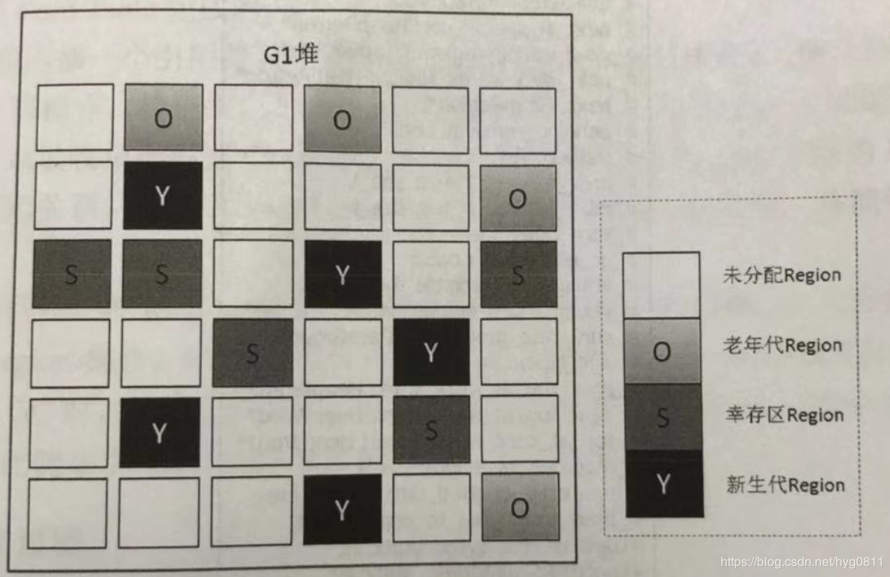
与CMS的标记-清除算法不同，G1从整体来看是基于标记-整理算法实现的收集器，从局部（两个Region之间）上来看是基于“复制”算法实现的。
G1还可以建立可以预测时间停顿模型，**因为它可以有计划地避免在整个Java堆中进行全区域的垃圾收集**。G1会通过一个合理的计算模型，计算出每个Region的收集成本并量化，这样一来，收集器在给定了“停顿”时间限制的情况下，总是能选择一组恰当的Regions作为收集目标，让其收集开销满足这个限制条件，以此达到实时收集的目的。
与CMS类似，G1也是通过三次标记和一次回收进行垃圾回收的：
初始标记（Initial Marking）：仅仅只是标记一下GC Roots能直接关联到的对象，并且修改TAMS（Next Top at Mark Start）的值，让下一阶段用户程序并发运行时，能在正确可用的Region中创建新对象，这阶段需要停顿线程，但耗时很短。

并发标记（Concurrent Marking）：是从GC Roots开始堆中对象进行可达性分析，找出存活的对象，这阶段耗时较长，但可与用户程序并发执行。

最终标记（Final Marking）：是为了修正并发标记期间因用户程序继续运作而导致标记产生变动的那一部分标记记录，虚拟机将这段时间对象变化记录在线程Remembered Set Logs里面，最终标记阶段需要把Remembered Set Logs的数据合并到Remembered Set中，这阶段需要停顿线程，但是可并行执行。

筛选回收（Live Data Counting and Evacuation）：首先对各个Region的回收价值和成本进行排序，根据用户所期望的GC停顿时间来制定回收计划。这个阶段也可以做到与用户程序一起并发执行，但是因为只回收一部分Region，时间是用户可控制的，而且停顿用户线程将大幅提高收集效率。

G1收集器在后台维护了一个**优先列表，每次根据允许的收集时间，优先选择回收价值最大的 Region**(这也就是它的名字 Garbage-First 的由来) 。
# redis
## redis的数据类型
String，hash，List，Set，Zset
其中String的底层实现是SDS，简单动态字符串
hash的底层实现是hashmap或listpack
list的底层实现是quicklist
set的底层实现是hashmap或整数集合
zset的底层实现是listpack或跳表，zset也有map，但是map主要是为了实现更方便的单点查找，主要实现还是跳表

## 为什么用跳表而不是平衡树？
1.跳表更适合范围查询
2.跳表修改起来更为便捷
3.跳表的内存占用比平衡树要少，因为平均只需要1/(1-0.25)的指针，0.25是增加层数的概率

跳表的查询过程：要查找一个节点p，那么
从头节点的最高层查起，**如果p的权重大于最高层的下一个节点**，那么就会移动到最高层的下一个节点
如果**p的权重等于最高层的下一个节点的权重，并且p的SDS元素大于最高层下一个节点的SDS元素**，会移动到下一个节点
如果**p的权重小于最高层下一个节点的权重**，那么会移动到头节点**level数组**的下一个节点，相当于**移动到下一层**，**如果节点的下一个节点为空也会移动到下一层**
如果**p的权重等于最高层的下一个节点的权重，并且p的SDS元素小于最高层下一个节点的SDS元素**，会移动到下一个节点
移动到下一个节点后，依然是和它的下一个节点进行比较，进入上述的移动，直到找到节点为止


listpack比起压缩列表，去掉了prev字段，使得在插入时不需要多米诺骨牌似的更新prev
quicklist相当于双向链表+压缩列表，压缩列表作为值存储在节点中


## 大Key会有什么影响
1.AOF日志写回硬盘时：如果是采用的always方式，即写操作一致性完就将AOF文件写文硬盘，那么由于此时是主线程在写，所以如果修改大Key，会造成主线程长时间阻塞，但是另外两种EverySec和no不会，因为会开一个另外的子线程

2.AOF重写和RDB：（1）如果有大Key，一是开启子进程需要复制主进程的页表，如果此时页表很大，那么复制页表会耗费很长的时间 (2) 当发生写操作时，会发生写时复制，操作系统会把主线程的物理内存复制给子线程一份，此时复制物理内存也很耗时。ps：RDB发生写时复制时，子线程会依照复制的物理内存写之前的数据库，新写入的是不会写的，因此如果此时redis崩溃，会造成数据丢失

还会有如下影响：
客户端超时阻塞。由于 Redis 执行命令是单线程处理，然后在操作大 key 时会比较耗时，那么就会阻塞 Redis，从客户端这一视角看，就是很久很久都没有响应。

引发网络阻塞。每次获取大key产生的网络流量较大，如果一个key的大小是1MB，每秒访问量为1000，那么每秒会产生1000MB的流量，这对于普通千兆网卡的服务器来说是灾难性的。

阻塞工作线程。如果使用del删除大key时，会阻塞工作线程，这样就没办法处理后续的命令。

内存分布不均。集群模型在 slot 分片均匀情况下，会出现数据和查询倾斜情况，部分有大 key 的 Redis 节点占用内存多，QPS 也会比较大。

大key的解决方法：在设计阶段就拆分成小key，或者定期检查删除大key，不要用del，因为会阻塞线程，用unlink，因为这样是异步处理的

## redis事务
redis事务通过MULTI,EXEC,DISCARD,WATCH,UNWATCH几个命令执行，
MULTI为开启事务
EXEC为提交事务
DISCARD为取消事务，放弃执行事务块中的所有命令
WATCH为监视某个键值，当其在WATCH后被修改过，则事务中断，不会执行事务中的任何命令
UNWATCH，取消监视
redis事务是没有原子性的，当事务中的命令发生错误时，会跳过错误的命令继续执行剩下的命令；但是当发生RuntimeException导致事务DISCARD的时候，事务里的所有命令都会放弃执行

WATCH常用于实现redis乐观锁

## 如何保证redis和数据库的数据一致性
旁路缓存策略：
写策略：先更新数据库，再删除缓存
读策略：命中直接返回，未命中先查询数据库，再更新缓存

对于写操作，无论是先更新数据库还是后更新数据库都有可能造成数据不一致的情况，
针对先更新数据库，再删除缓存造成的不一致，可以通过分布式锁的方式解决，或者给缓存加一个很短的过期时间
针对先删除缓存，再更新数据库造成的不一致，可以通过延迟双删解决

对于写策略，如果第二步删除缓存操作失败，那么也是造成数据不一致，要解决这个问题可以通过：
1.重试，通过消息队列，把要删除的数据放入消息队列中，当删除失败时通过消息队列进行重试
2.通过查询数据库binlog再进行相应操作

## redis单线程为什么还这么快
1.redis的操作基本都在内存中完成，比读硬盘快很多
2.redis采用的单线程模型可以避免多线程之间的竞争
3.redis采用了I/0多路复用机制处理了大量的客户端请求

redis引入多线程只是使用了多个I/O进程来处理网络请求，是为了提高I/O的并发度，但是在处理数据的时候仍然是用的单线程

## select为什么最大文件描述符数量是1024
取决于内核的参数FD_SETSIZE参数，这个参数是select中存放socket的数组大小，而进程的文件描述符最大为1024，因此select才把数组大小设计为1024

## redis的持久化
redis通过AOF日志和RDB来实现持久化。其中AOF是通过将执行命令追加到AOF日志中，在redis重启之后通过逐步执行AOF中的命令来恢复数据.AOF写回硬盘的操作有三种，1.写操作完成后立刻写回硬盘，2.每隔一秒将缓冲区的数据写回硬盘，3.由操作系统决定什么时候写回硬盘
AOF文件过大时会触发AOF重写机制，当AOF文件大小超过阈值时，redis会根据当前数据库里的数据重写AOF文件，这样就可以省去以前AOF文件里一些重复的操作，在重写AOF文件时，通常是通过一个子进程实现的，在重写的过程中，主进程仍然可以写入，不过此时除了要写入AOF缓冲区，还要写入AOF重写缓冲区，等子进程重写完毕后，再将AOF重写缓冲区里的内容追加到新的AOF文件，并替换掉新的
RDB通过快照保存了当前的数据，因此其恢复起来比AOF要快，因为只需要加载数据就可以了。

## RDB和AOF的使用场景
RDB持久化方式是将Redis在内存中的数据以快照的形式保存到磁盘上，优点是备份较快，恢复数据速度较快，且占用的磁盘空间较小，在数据恢复中会比AOF快，但缺点是若Redis在持久化过程中突然宕机，可能会丢失部分数据。因此，适合数据更新较少，但需要频繁备份的场景，如数据量较大的缓存场景。

AOF持久化方式是将Redis的操作日志以追加的方式写入到另一个文件中，优点是可靠性更高，可以保证几乎不会丢失数据，但缺点是备份和恢复速度均比RDB慢，且占用的磁盘空间较大。因此，适合对数据安全性要求较高的场景，如数据量较少的持久化场景。

## 服务高可用
redis实现服务高可用：
1.主从复制，指定一个主节点用于写和读，其余的从节点只负责读，减缓了主节点的压力
2.哨兵，添加一个另外的监督主从节点的哨兵
3.切片集群，一个切片集群有16384个哈希槽，根据集群数量不同，每个集群分到的哈希槽数目也不同，数据会根据hash key的值通过CRC16算法得出一个16bit的值，再对16384取余分配到对应的redis集群里去

## 过期删除和内存淘汰
redis过期删除策略：惰性删除，定期删除
惰性删除：访问到键过期了才执行删除操作
定期删除：每隔一段时间抽取一部分键检查是否过期，如果过期则删除，当过期的键占被选取键的25%，会重复执行该过程，为了防止删除卡死，会为删除时间设计一个阈值，当删除时间超过这个阈值则退出删除操作

## 持久化时对过期键的处理
redis持久化时对过期键如何处理：
RDB:
1.生成持久化文件文件时：会对key进行检查，过期的key不会被保存到文件中
2.加载时：对主节点会进行检查，如果为空不会被加载到数据库，对从节点则不会进行检查，因为主从同步的时候会先删除从节点里的所有数据

AOF：
1.AOF写入阶段：如果键还没有过期，那么会先保留键，等键过期后，会追加删除语句
2.AOF重写阶段：会对过期的键进行检查，过期的键不会被写入AOF文件中

## LRU算法和LFU算法
LRU是最近最久未使用算法，由于存在需要占用额外空间，并且会造成缓存污染的情况，因此redis并没有采用
LFU是最近最少使用算法，添加了一个数据访问频次的字段

## 缓存雪崩、击穿、穿透
缓存雪崩：指短时间内大量的缓存过期，造成应用没有命中缓存转而访问数据库给数据库带来极大压力的现象，解决方法可以打乱key的过期时间或设置不过期

缓存击穿：与缓存雪崩类似，指热点缓存过期，造成数据库压力大的现象，可以通过互斥锁（同一时间只有一个线程可以访问缓存，其他未能获取锁的线程要么等待锁的释放，要么直接返回默认值或空）或者设置热点缓存不过期

缓存穿透：指短时间内访问大量缓存中也没有，数据库也没有的数据造成数据库压力大的情况，可以通过拦截非法请求，或者返回空与默认值，或者通过布隆过滤器判断有没有数据存在而不需要经过数据库

## 缓存更新策略
1.旁路缓存
2.写穿/读穿，相当于线程不与数据库交互，全权由缓存与数据库交互
3.写回，在更新数据时，先只更新缓存，标为脏数据，之后对数据库的更新会异步进行，适合写特别多的情况

## redis如何实现延迟队列
通过redis里的有序集合ZSet中的Score属性存储延时时间，并对任务进行排序实现

## 利用redis实现分布式锁
通过redis的Set命令中的NX参数，NX参数可以实现”只有键不存在时才可以插入“
如果 key 不存在，则显示插入成功，可以用来表示加锁成功；
如果 key 存在，则会显示插入失败，可以用来表示加锁失败。
```
SET lock_key unique_value NX PX 10000 
```
NX即为上面的锁，PX 10000设置过期时间为10s，防止线程持有锁太久，unique_value用来标识不同的线程，确保获得锁和释放锁都是同一个线程在进行
主要释放锁时需要两步操作：1.判断锁是否是正确的线程持有，2.删除锁，这两个是一个原子操作，因此需要配合Lua脚本实现

## Redis主从复制
三种主从沟通方式：
1.初次同步
从服务器 Slave 向主服务器 Master 发送数据同步命令；

Master 主服务器接收到同步命令后，保存快照生成 RDB 文件，同时使用缓冲区replication buffer记录从现在开始执行的所有写命令；

Master 主服务器将快照文件（RDB文件）发送给 Slave 从服务器，**Slave 从服务器接收到后，清空旧数据，载入新数据**；

Master 主服务器快照发送完后开始向 Slave 从服务器发送缓冲区的写命令，Slave 从服务器接收命令并执行，完成复制初始化；

此后 Master 主服务器每次执行一个写命令都会同步发送给 Slave 从服务器，保持相互之间数据的一致性；

2.命令传播，主节点和从节点会建立TCP长连接，期间的主节点写命令都会复制到从节点

3.增量复制，在网络断开一段时候恢复后，从节点会使用在一个环形缓冲区repl_backlog_buffer的偏移与主节点计算增量，如果数据还在缓冲区里，那么会将其写入replication buffer缓冲区由主节点发送给从节点，如果数据已经被覆盖，那么会进行全量同步

## 哨兵
哨兵通过ping的方式试探主从节点是否存活，当其发现主节点已挂的时候，1.会选出新的主节点，选取方式如下：
排除网络不好的节点——选取优先级最高的节点——选取复制进度最快的节点——选取id最小的节点
按照这个顺序选取出新的子节点
2.将所有节点指向新的主节点
3.通知客户端主节点已更换
4.将旧主节点指向新的主节点

## 如何解决脑裂现象
脑裂现象是指主节点因为网络波动等原因暂时失联，期间哨兵选出了新的主节点。如果期间客户端仍然在向主节点写入信息，那么等旧主节点恢复后集群中就存在两个主节点，在其与新的主节点进行同步时，客户端写入的消息会丢失(因为主从复制第一次同步从节点会先清空)，这就导致了消息的丢失。
想要解决就需要设置Redis关于从节点的两个参数
min-replicas-to-write 1(N)
min-replicas-max-lag 10(M)
第一个参数指至少有一个从节点存活时，主节点才能进行写入，否则拒绝写入
第二个参数指主节点多长时间（秒）无法得到从节点的响应，就认为这个节点失联。我们这里配置的是 10 秒，也就是说主节点10 秒都得不到一个从节点的响应，就会
认为这个从节点失联，停止接受新的写入命令请求。
也就是说，主节点只有在至少有N个从节点存活，且和每个从节点通信时间都不少于M时才能接受新的写入请求，否则拒绝新的请求。**这样在发生脑裂时，旧的主节点因为没有足够的从节点，因此会拒绝新的写入**
# spring
## springboot实现自动配置的原理
自动配置指的是通过注解或者简单配置就可以在SpringBoot的帮助下实现某块功能。比如使用Redis的时候，只要用Maven和yml进行相应配置，就可以在需要的地方直接使用相应的模块功能(自动加入IOC容器中)，而不需要手动引入或者进行相应配置

自动配置主要依赖下面的注解
```
@SpringbootApplication
    @SpringBootConfigration
    @EnableAutoConfiguration
    @ComponentScan
```
@SpringBootConfigration是对@Configration的封装，指明这是一个配置类
Springboot的配置主要来自于@ComponentScan注解和@EnableAutoConfiguration注解。

@ComponentScan用于对指定的package进行扫描，找到符合条件的类，默认是扫描被@Component修饰的类。如果没有指定package，则默认扫描当前@ComponentScan所修饰的类所在的package。

@EnableAutoConfiguration是实现自动配置的关键
```
@Target({ElementType.TYPE})
@Retention(RetentionPolicy.RUNTIME)
@Documented
@Inherited
@AutoConfigurationPackage
@Import({AutoConfigurationImportSelector.class})
public @interface EnableAutoConfiguration {
    String ENABLED_OVERRIDE_PROPERTY = "spring.boot.enableautoconfiguration";

    Class<?>[] exclude() default {};

    String[] excludeName() default {};
}
```
**EnableAutoConfiguration通过注解@import导入了ImportSelector的实现类AutoConfigurationImportSelector**
@import的作用是提供了一种显示地从其他地方加载配置类的方式，这样可以避免使用性能较差的组件扫描(@ComponentScan)。
@import支持三种导入方式，1.普通类，2.接口ImportSelector的实现类，3.接口ImportBeanDefinitionRegistrar的实现类。由于EnableAutoConfiguration使用的导入方式是第二种，因此这里给出一个使用第二种方式导入的例子：
```
接口ImportSelector有一个selectImports方法，返回值是一个字符串数组，数组中的每个元素分别代表一个将被导入的配置类的全限定名
//创建一个普通类
public class ZooConfig{
    @Bean
    public Tiger tiger(){
        return new Tiger();
    }
}

public class Tiger{

}
//创建一个ImportSelector实现类
public class ZooImportSelector implements ImportSelector{
    @Override
    public String[] selectImports(AnnotationMetadata metadata){
        return new String[]{"cn.memset.ZooConfig}//返回普通类ZooConfig的全限定名
    }
}
//创建一个配置类，将ImportSelector实现类导入
@Configuration
@Import({ZooImportSelector.calss})
public class ConfigB{

}
//测试
public static void main(String args[]){
    ApplicationContext ctx = new AnnotationConfigApplicationContext(ConfigB.class)
    //现在Bean ZooConfig和Tiger都在IOC容器中，并且可用
    ZooConfig zc = ctx.getBean(ZooConfig.class);
    Tiger t = ctx.getBean(Tiger.class);
    System.out.println(zc.getClass().getSimpleName());
    System.out.println(t.getClass().getSimpleName());
输出：
zooConfig(类名)
tiger(类名)
}
```
而AutoConfigurationImportSelector中selectImports部分的源码为
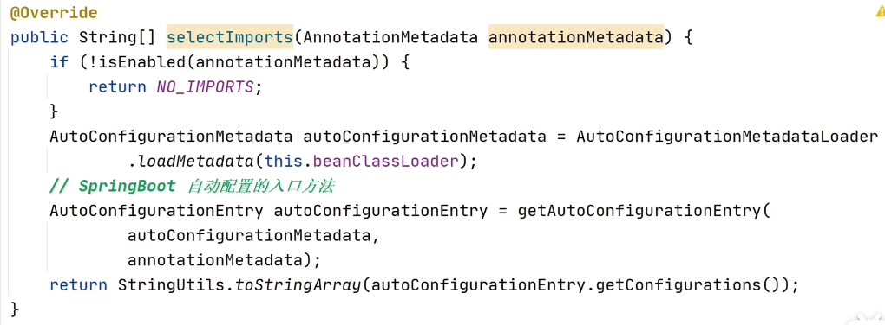
其中方法getAutoConfigurationEntry为自动配置的入口方法，其源码为
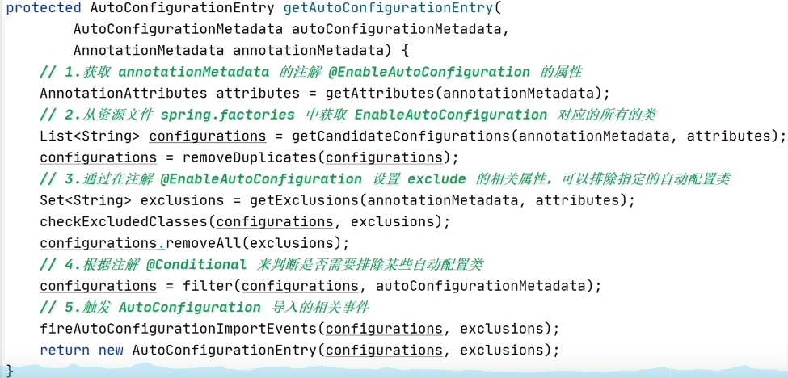
其中第2步中的getCandidateConfigurations方法为SpringFactories机制，从配置文件spring.factorie中找出所有的自动配置类的方法

其中loadFactoryNames方法会通过Spring Factories(类似于SPI)机制加载配置文件
META-INF/spring.factories(由第三方jar包提供，配置信息通常以键值对的形式存在，键是接口或注解的全限定名，值是对应的实现类的全限定名。)，再根据@Conditional注解，过滤掉不必要的自动配置类

简要来讲，SpringBoot实现自动配置的链条为：
@SpringBootApplication -> 
@EnableAutoConfiguration -> 
@import(导入selectImports返回的全限定类名字符串数组，得到BeanDifination) ->
AutoConfigurationImportSelector ->
selectImports(返回全限定类名字符串数组，通过getCandidateConfigurations取得) ->
getAutoConfigurationEntry ->
getCandidateConfigurations(通过SpringFactoriesLoader加载第三方jar包提供的META-INF/spring.factories文件，返回所需配置的全限定类名字符串数组)
## MVC模型

## spring事务
### 事务传播

```
@RestController
public class UserController {
    private LogService logService;

    @Transactional
    public Object save(User user) {
        // 插入用户操作
        userService.save(user);
        // 插入日志
        logService.saveLog("用户插入：" + user.getName());
        return true;
    }
}

public class UserService {
    @Resource
    private UserMapper userMapper;

    @Transactional(propagation = Propagation.REQUIRED_NEW)
    public int save(User user) {
        return userMapper.save(user);
    }
}

public class LogService {
    @Resource
    private LogMapper logMapper;

    @Transactional(propagation = Propagation.NESTED)
    public int saveLog(String content) {
        // 出现异常
        int i = 10 / 0;
        return logMapper.saveLog(content);
    }
}
```
REQURES_NEW和NESTED都会开启新事务，在当前事务失败后不会影响外部事务。不同的是，REQUERES_NEW开启的**新事务可能会在外部事务完成之前进行提交**,而NESTED开启的**新事务会随着外部事务一起进行提交**。
比如UserService开启的事务是REQUIRED_NEW，那么UserService会**开启自己的新事务，并将当前事务挂起**，在完成后就会提交，在外部Controller的事务发生异常时Controller的事务回滚，但是UserService的事务已经提交了，不能回滚，这就会造成脏数据的产生
LogService开启的事务是NESTED，那么LogService也会**开启一个新事务，但是这个事务是和外部事务嵌套的**，在LogService事务完成后，它并不会马上提交，而是会和外部Controller的事务一起提交，不会造成脏数据的产生
REQUIRED_NEW的应用场景是需要进行某些独立的操作，而NESTED的应用场景是需要进行某些子操作

### 事务失效
事务实现分为编程式事务与声明式事务，编程式事务是通过编码的方式来实现事务，而声明式事务是通过注解的方式来实现事务。
当使用Transactional注解进行声明式事务时，以下几种情况会导致事务失效：
1、Transactional修饰的方法不是public方法
2、使用了Transactional注解中的timeout参数，并且方法的执行时间超过了该参数设置的时间
3、代码里有try/catch
4、方法A调用Transactional修饰的方法B，但是方法A没有Transactional修饰，这种情况B内出现异常时也会导致无法回滚，事务失效
5、数据库层面不支持事务，比如使用了myisam数据库
## Spring是如何解决的循环依赖
Spring通过三级缓存解决了循环依赖，其中一级缓存为单例池（singletonObjects）,二级缓存为早期曝光对象earlySingletonObjects，三级缓存为早期曝光对象工厂（singletonFactories）。当A、B两个类发生循环引用时，在A完成实例化后，就使用实例化后的对象去创建一个对象工厂，并添加到三级缓存中，如果A被AOP代理，那么通过这个工厂获取到的就是A代理后的对象，如果A没有被AOP代理，那么这个工厂获取到的就是A实例化的对象。当A进行属性注入时，会去创建B，同时B又依赖了A，所以创建B的同时又会去调用getBean(a)来获取需要的依赖，此时的getBean(a)会从缓存中获取，第一步，先获取到三级缓存中的工厂；第二步，调用对象工工厂的getObject方法来获取到对应的对象，得到这个对象后将其注入到B中。紧接着B会走完它的生命周期流程，包括初始化、后置处理器等。当B创建完后，会将B再注入到A中，此时A再完成它的整个生命周期。至此，循环依赖结束
解决循环依赖的核心代码：
```
/** Cache of singleton objects: bean name --> bean instance */
private final Map<String, Object> singletonObjects = new ConcurrentHashMap<String, Object>(256);
 
/** Cache of early singleton objects: bean name --> bean instance */
private final Map<String, Object> earlySingletonObjects = new HashMap<String, Object>(16);

/** Cache of singleton factories: bean name --> ObjectFactory */
private final Map<String, ObjectFactory<?>> singletonFactories = new HashMap<String, ObjectFactory<?>>(16);
//以上是三级缓存的定义

protected Object getSingleton(String beanName, boolean allowEarlyReference) {
  // Spring首先从singletonObjects（一级缓存）中尝试获取
  Object singletonObject = this.singletonObjects.get(beanName);
  // 若是获取不到而且对象在建立中，则尝试从earlySingletonObjects(二级缓存)中获取
  if (singletonObject == null && isSingletonCurrentlyInCreation(beanName)) {
    synchronized (this.singletonObjects) {
        singletonObject = this.earlySingletonObjects.get(beanName);
        if (singletonObject == null && allowEarlyReference) {
          ObjectFactory<?> singletonFactory = this.singletonFactories.get(beanName);
          if (singletonFactory != null) {
            //若是仍是获取不到而且容许从singletonFactories经过getObject获取，则经过singletonFactory.getObject()(三级缓存)获取
              singletonObject = singletonFactory.getObject();
              //若是获取到了则将singletonObject放入到earlySingletonObjects,也就是将三级缓存提高到二级缓存中
              this.earlySingletonObjects.put(beanName, singletonObject);
              this.singletonFactories.remove(beanName);
          }
        }
    }
  }
  return (singletonObject != NULL_OBJECT ? singletonObject : null);
}
```
https://pdai.tech/md/spring/spring-x-framework-ioc-source-3.html
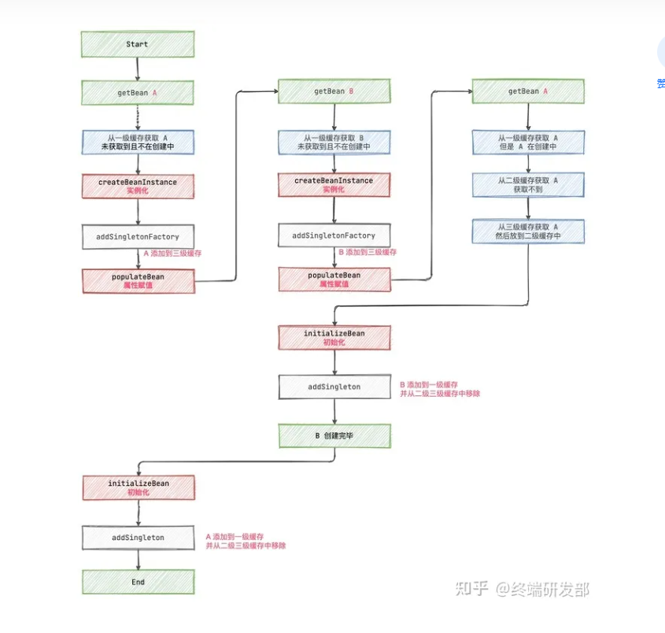

## 为什么要使用三级缓存呢？二级缓存能解决循环依赖吗
需要知道的是，在singletonFactory.getObject()这一步，如果Bean是被代理的(比如AOP代理)，那么返回的是Bean的代理对象，否则返回Bean本身。

并且，**一级缓存用于存放初始化完成后的bean，二次缓存用于存放实例化后的bean，如果bean有代理的话，那么此时存放的是其代理对象**

**二级缓存其实也是能解决循环依赖的**，直接放earlySingletonObject就可以了，那么为什么还要三级缓存呢？因为直接放earlySingletonObject，如果此时bean实现了代理，那么earlySingletonObject就是对应的代理对象，这时候意味着bean在实例化阶段就生成代理对象了。但是spring的设计原则应该是在实例化，属性设置和初始化之后才生成代理对象，这就违背了spring的设计原则。
如果Bean之间有循环依赖，那么提前代理无法避免，因为此时需要从缓存中获取对应的对象，这时候二级缓存三级缓存差别不大。但是如果没有循环依赖，在没有三级缓存的情况下，bean仍然需要提前代理。也就是说，**三级缓存的作用其实是使没有循环依赖的bean不会被提前代理(因为没有调用singletonFactory.getObject()方法)，而是bean生命周期走完后再代理，最大程度上保证了spring的设计原则**

如果只有二级缓存，为了解决循环依赖相当于无论是否有循环依赖问题，在有代理的情况下，每个bean在实例化后都必须将代理对象放入二级缓存中，造成了没有循环依赖的bean也被提前代理。

## @Resource和@Autowired的区别
Autowired默认bytype注入，type就是方法的变量类型，如果存在多个相同的type，需要依据注解@Qualifier("ClassName")来指定名称
Resource默认byName注入，如果没有相同名称则会byType进行匹配，如果匹配不到，就会报错。并且Resource是可以指定name和type的，如果使用了name就会byName匹配，如果使用了type就会byType进行匹配
如果加上@Qualifier("ClassName")，就会默认byName进行匹配，比如
```
public class CookPatato implements Cook
@Autowired
@Qualifier("CookPatato")
```
而@Resource还可以指定name：
```
1.@Resource(name="CookPatato")

2.@Resource
  @Qualifier("CookPatato")
```
还可以通过在实现类上加@Primary指定优先注入
```
@Primary
public class CookPatato implements Cook
```
## 依赖注入的原理
1.通过依赖类的构造函数注入
2.通过依赖类的setter函数注入
3.通过依赖类实现接口的方式
```
public interface BoyInjection {

    void inject(Boy boy);
}
public class Classes implements BoyInjection {
    //....

    private Boy boy;

    @Override
    public void inject(Boy boy) {
        //实现接口中的方法
        this.boy = boy;
    }
}
```
4.通过字段@Autowired或者@Resource注入
## bean的生命周期

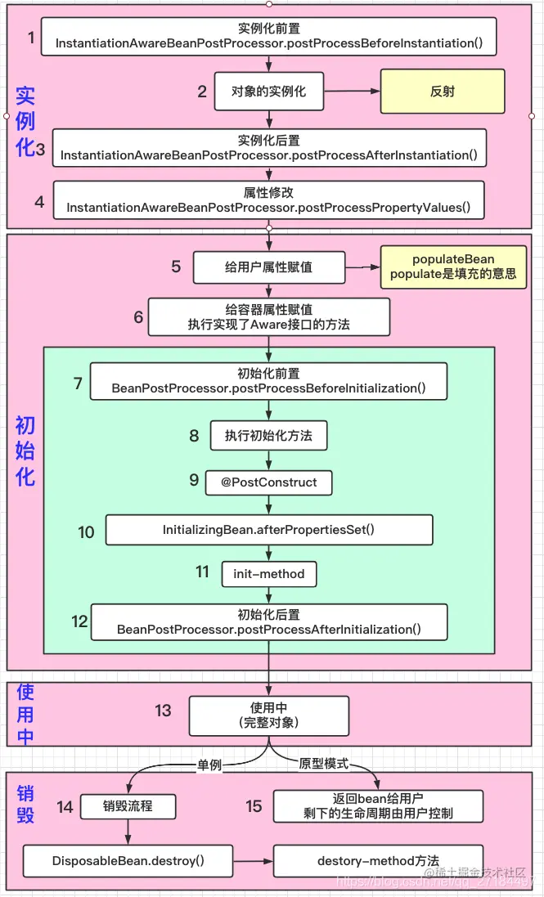

一、通过反射对bean进行加载

二、生产bean
1、bean实例化

2、属性填充
populate中的对象属性为bean对象持有的其他自定义bean，如User，Service等，通常就是@Autowired注解的对象，进行填充时需要到三级缓存里获取对应的属性对象

3、初始化
3.1 初始化容器
Aware相关接口用于获取相关资源，如果第2步中bean属性实现了相关的Aware接口，那么就会调用相关Aware接口执行set方法，比如**实现了BeanFactoryAware方法，那么就会执行setBeanFactory**

3.2 执行初始化方法
通过invokeInitMethods方法执行Bean的初始化方法，这个初始化方法是通过实现InitializingBean接口而实现的afterPropertiesSet方法

在执行完afterPropertiesSet方法后，还会继续执行在Bean上自定义的initMethod方法，比如
```
public class TestService{
    public void initMethod() throws Exception {
        System.out.println("afterPropertiesSet之后执行")
    }
}

@Service
public class TestOtherService {

    @Bean(initMethod = "initMethod")
    public TestService testService() {
        return new TestService();
    }
}
```
**init-method用来在bean初始化的时候执行指定方法，比如数据库连接之类的**
3.3 执行初始化方法前后
通过
applyBeanPostProcessors**Before**Initialization
applyBeanPostProcessors**After**Initialization
两个方法在初始化前后执行各种Bean的后置处理器，包括负责“构造后@PostConstruct”的InitDestoryAnnotationBeanPostProcessor等系统级处理器；或者通过实现BeanPostProcessor接口的自定义处理器，比如
```
@Service
public class TestService implements BeanPostProcessor {
    @override
    public Object postProcessorsBeforeInitialization(Object bean,String beanName) throws BeansException {
        System.out.println("afterPropertiesSet之前执行");
        return "";
    }

    @override
    public Object postProcessorsAfterInitialization(Object bean,String beanName) throws BeansException {
        System.out.println("afterPropertiesSet之后执行");
        return "";
    }
}
```
4、注册销毁
通过registerDisposableBean方法，将实现了销毁接口DisposableBean的Bean进行注册，这样在销毁时就可以调用destroy方法进行销毁

5、通过1,2,3,4步，bean就创建完成了，之后将这些完整的bean方法调用addSingleton方法将bean加入三级缓存的单例池中，产生bean就完成了

三、销毁
首先会执行PostProcessBeforeDestruction处理器，用来执行bean中被@preDestory注解的方法

然后通过destroyBean方法销毁对象，销毁时会执行前面提到的destroy方法

之后会通过invokeCustomDestoryMethod方法，来执行在bean上自定义的destroyMethod方法

在销毁阶段，如果bean是单例模式，那么会先调用**DisposableBean.destory()**，然后调用**destory-method**
```
public class InitMethod  {
 
    // 在@Bean注解上添加initMethod属性，指向类中的 initMethod_1 执行初始化方法
    // 在@Bean注解上添加destroyMethod属性，指向类中的 destroyMethod_1 执行销毁方法
    @Bean(initMethod = "initMethod_1",destroyMethod = "destroyMethod_1")
    public BeanTest getBeanTest(){
        return new BeanTest();
    }
}
BeanTest.java

package com.Spring.Boot.init.bean;
 
public class BeanTest {
 
    // 将要执行的初始化方法
    public void initMethod_1(){
        System.out.println("我是beanTest的init方法");
    }
 
    // 将要执行的销毁方法
    public void destroyMethod_1(){
        System.out.println("我是beanTest的init方法");
    }
 
 
}
```
如果是原型模型，那么会返回bean给用户由用户处理。原型模式是指通过深拷贝的方式创建一个重复的对象，这种模式是实现了一个原型接口，该接口用于创建当前对象的克隆。当直接创建对象的代价比较大时，则采用这种模式。
## bean会有线程安全问题吗
多例Bean每次都会新创建新实例，也就是说线程之间不存在Bean共享的问题。因此，多例Bean是不存在线程安全问题的。

而单例Bean是所有线程共享一个实例，因此，就可能会存在线程安全问题。但是单例Bean又分为无状态Bean和有状态Bean。在多线程操作中只会对Bean的成员变量进行查询操作，不会修改成员变量的值，这样的Bean称之为无状态Bean。所以，可想而知，无状态的单例Bean是不存在线程安全问题的。但是，在多线程操作中如果需要对Bean中的成员变量进行数据更新操作，这样的Bean称之为有状态Bean，所以，有状态的单例Bean就可能存在线程安全问题。

所以，最终我们得出结论，只有有状态的单例Bean才会存在线程安全问题。

## 如何解决单例Bean下的线程安全问题
1.将Bean的作用域由 “singleton” 单例 改为 “prototype” 多例。

2.在Bean对象中避免定义可变的成员变量

3.在类中定义 ThreadLocal 的成员变量，并将需要的可变成员变量保存在 ThreadLocal 中

## AOP
### AOP的一些术语
面向切面编程，目的是把一部分类的共同动作抽象出来，完成对类的解耦。OOP的核心思想是封装，AOP的核心思想是解耦。OOP面向对象编程，针对业务处理过程的实体及其属性和行为进行抽象封装，以获得更加清晰高效的逻辑单元划分。而AOP则是针对业务处理过程中的切面进行提取，它所面对的是处理过程的某个步骤或阶段，以获得逻辑过程的中各部分之间低耦合的隔离效果。

AOP的几个术语
连接点（Jointpoint）：表示需要在程序中插入横切关注点的扩展点，连接点可能是类初始化、方法执行、方法调用、字段调用或处理异常等等，Spring只支持方法执行连接点，在AOP中表示为**在哪里干**；**指单个方法**

切入点（Pointcut）： **选择一组相关连接点的模式，即可以认为连接点的集合**，Spring支持perl5正则表达式和AspectJ切入点模式，Spring默认使用AspectJ语法，在AOP中表示为在哪里干的集合；**其实就是指方法，在切入点切入=在方法中切入**

通知（Advice）：在连接点上执行的行为，通知提供了在AOP中需要在切入点所选择的连接点处进行扩展现有行为的手段；包括前置通知（before advice）、后置通知(after advice)、环绕通知（around advice），在Spring中通过代理模式实现AOP，并通过拦截器模式以环绕连接点的拦截器链织入通知；**在AOP中表示为干什么**；**就是要在方法里切入什么功能，指许多方法的集合**

方面/切面（Aspect）：横切关注点的模块化，比如上边提到的日志组件。可以认为是通知、引入和切入点的组合；在Spring中可以使用Schema和@AspectJ方式进行组织实现；在AOP中表示为在哪干和干什么集合；引入（inter-type declaration）：也称为内部类型声明，为已有的类添加额外新的字段或方法，Spring允许引入新的接口（必须对应一个实现）到所有被代理对象（目标对象）, 在AOP中表示为干什么（引入什么）；**其实就是切入点+通知的集合**

目标对象（Target Object）：需要被织入横切关注点的对象，即该对象是切入点选择的对象，需要被通知的对象，从而也可称为被通知对象；由于Spring AOP 通过代理模式实现，从而这个对象永远是被代理对象，在AOP中表示为对谁干；

织入（Weaving）：把切面连接到其它的应用程序类型或者对象上，并创建一个被通知的对象。这些可以在编译时（例如使用AspectJ编译器），类加载时和运行时完成。Spring和其他纯Java AOP框架一样，在运行时完成织入。**在AOP中表示为怎么实现的**；**怎么实现AOP功能的**

AOP代理（AOP Proxy）：AOP框架使用代理模式创建的对象，从而实现在连接点处插入通知（即应用切面），就是通过代理来对目标对象应用切面。在Spring中，AOP代理可以用JDK动态代理或CGLIB代理实现，而通过拦截器模型应用切面。在AOP中表示为怎么实现的一种典型方式；

### 几个通知类型
前置通知（Before advice）：在某连接点之前执行的通知，但这个通知不能阻止连接点之前的执行流程（除非它抛出一个异常）。**方法执行前通知**

后置通知（After returning advice）：在某连接点正常完成后执行的通知：例如，一个方法没有抛出任何异常，正常返回。**方法执行完毕后通知**

异常通知（After throwing advice）：在方法抛出异常退出时执行的通知。

最终通知（After (finally) advice）：当某连接点退出的时候执行的通知（不论是正常返回还是异常退出）。

环绕通知（Around Advice）：包围一个连接点的通知，如方法调用。这是最强大的一种通知类型。环绕通知可以在方法调用前后完成自定义的行为。它也会选择是否继续执行连接点或直接返回它自己的返回值或抛出异常来结束执行。**在方法整个执行周期，包括前后的通知**

### 一个AOP的实验
todo

### 几个AOP的实现方式
1.基于AspectJ
2.基于代理模式：详见设计模式中的代理模式章节

# mq
## mq消息丢失问题
mq消息丢失可能存在三种可能，生产者端丢失，mq丢失，消费者取到了消息但还没处理造成的丢失
针对生产者端：1.开始rabbitMQ的事务机制，在发送数据之前开启事务，如果消息没被mq接收到生产者端会报错，此时可以回滚事务然后重发消息，如果收到了消息就可以提交事务
2.使用confirm机制，confirm机制和事务最大的不同就是它是异步的。开启confirm机制后，每个消息会有一个独特的id，mq收到消息后会返回一个ack，如果没有收到消息会回调nack接口告知发送失败，这时可以尝试重发；同时，因为每个消息都有唯一的id，因此在一段时间后没有收到ack，生产者端可以自己重发消息（所谓的补偿机制）
```
/**
 * @description : 消息生产者
 */
@Component
@Slf4j
public class RabbitmqProducer {

    @Autowired
    private RabbitTemplate rabbitTemplate;

    public void sendMessage(Map<String, Object> headers, Object message, String messageId, String exchangeName, String key) {
        // 自定义消息头
        MessageHeaders messageHeaders = new MessageHeaders(headers);
        // 创建消息
        Message<Object> msg = MessageBuilder.createMessage(message, messageHeaders);
        /* 确认的回调 确认消息是否到达 Broker 服务器 其实就是是否到达交换器
         * 如果发送时候指定的交换器不存在 ack 就是 false 代表消息不可达
         */
        rabbitTemplate.setConfirmCallback((correlationData, ack, cause) -> {
            log.info("correlationData：{} , ack:{}", correlationData.getId(), ack);
            if (!ack) {
                System.out.println("进行对应的消息补偿机制");
            }
        });
        // 在实际中ID 应该是全局唯一 能够唯一标识消息 消息不可达的时候触发ConfirmCallback回调方法时可以获取该值，进行对应的错误处理
        CorrelationData correlationData = new CorrelationData(messageId);
        rabbitTemplate.convertAndSend(exchangeName, key, msg, correlationData);
    }
}
```

针对mq端：对mq的消息持久化到硬盘上或集群，集群分为普通集群和镜像集群，普通集群是有多个rabbitmq实例，但只会有一个队列queue，每个实例都有queue的元信息(queue的一些配置，通过queue的元信息可以找到queue所在实例)。queue只会保存在一个rabbitmq实例A上，如果在消费时连接到了另一个raabitmq实例B，B会从A处将queue的信息拉取过来。

镜像集群下每一个rabbitmq实例都会有完整的queue的消息，到写消息到queue上时，可以同步消息到其他所有queue或者指定数量的queue。这样的好处是任意一个rabbitmq实例宕机也不影响，坏处是开销太大

针对消费者端：使用raabitmq的ack机制，先关掉mq的自动ack，在消息处理完之后在代码里手动ack。这里的ack是由消费者发送到mq的，与生产这段的ack不同。
## mq重复消费问题
mq不处理重复消费问题，通常是在业务代码消费者端里自行处理。要求实现幂等性，seckill里是通过用户id+商品id的唯一索引实现

还有一种方案是加一个消息处理表，在消息来之后先查表看有没有消费过，如果消费过就丢弃

## mq如何保证顺序消息
对于 RabbitMQ 来说，导致上面顺序错乱的原因通常是消费者是集群部署，不同的消费者消费到了同一订单的不同的消息，如消费者 A 执行了增加，消费者 B 执行了修改，消费者 C 执行了删除，但是消费者 C 执行比消费者 B 快，消费者 B 又比消费者 A 快，就会导致消费 binlog 执行到数据库的时候顺序错乱，本该顺序是增加、修改、删除，变成了删除、修改、增加。

解决这种问题的方案是，将queue分成多个，每个消费者固定消费一个queue里面的消息，生产者在发送消息的时候将同一个订单号的消息发送到同一个queue中。这样因为一个queue里面的消息是有序的，而一个queue又只会被一个消费者顺序消费，进而保证了消息的顺序性。
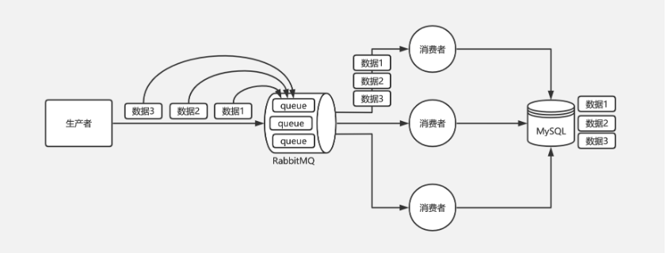
# 网络
## 浏览器敲下URL发生了什么？
DNS 解析：当用户输入一个网址并按下回车键的时候，浏览器获得一个域名，而在实际通信过程中，我们需要的是一个 IP 地址，因此我们需要先把域名转换成相应 IP 地址。

TCP 连接：浏览器通过 DNS 获取到 Web 服务器真正的 IP 地址后，便向 Web 服务器发起 TCP 连接请求，通过 TCP 三次握手建立好连接。

建立TCP协议时，需要发送数据，发送数据在网络层使用IP协议， 通过IP协议将IP地址封装为IP数据报；然后此时会用到ARP协议，主机发送信息时将包含目标IP地址的ARP请求广播到网络上的所有主机，并接收返回消息，以此确定目标的物理地址，找到目的MAC地址；

IP数据包在路由器之间，路由选择使用OSPF协议， 采用Dijkstra算法来计算最短路径树，抵达服务端。
发送 HTTP 请求：建立 TCP 连接之后，浏览器向 Web 服务器发起一个 HTTP 请求（如果是HTTPS协议，发送HTTP 请求之前还需要完成TLS四次握手）；

处理请求并返回：服务器获取到客户端的 HTTP 请求后，会根据 HTTP 请求中的内容来决定如何获取相应的文件，并将文件发送给浏览器。

浏览器渲染：浏览器根据响应开始显示页面，首先解析 HTML 文件构建 DOM 树，然后解析 CSS 文件构建渲染树，等到渲染树构建完成后，浏览器开始布局渲染树并将其绘制到屏幕上
## TCP
### 没有滑动窗口会发生什么
1.无法实现流量控制。接收方无法告知发送方此时自己的处理能力，因此可能会导致发送方发送的消息丢失

2.无法实现可靠传输。接收窗口可以使发送方知道哪些消息被接受，哪些消息没有被接受，对于没有被接受的消息会启动超时重传，并且滑动窗口需要保证最前面的消息接收到之后才滑动，因此保证了消息的有序性。
### 为什么需要time-wait
1.防止历史连接中的数据被后面相同的四元组接受造成数据的错乱
2.确保被连接端可以正确关闭，因为连接端的ACK可能会丢失，此时为了接收到被连接端最后的fin报文，所以需要等待2msl的时间(ACK过去一个msl，fin过来一个msl)

### time-wait过多的危害
1.文件描述符占用，得不到释放，占用cpu资源，内存资源，线程资源
2.端口资源被占用，对于客户端来说，相同的源端口和目标端口的连接是有限的，过多的time-wait会使得无法建立相同的源端口和目标端口，但是不同的相同的源端口去连接不同目标端口还是可以连接的

### 为什么会出现过多的time-wait
1.连接方式采用的短连接，执行完一个请求就进入time-wait状态
2.长连接超时。客户端超过一定时间没有发起请求，服务端断开连接
3.HTTP 长连接的请求数量达到上限。Web 服务端通常会有个参数，来定义一条 HTTP 长连接上最大能处理的请求数量，当超过最大限制时，就会主动关闭连接。比如nginx 的 keepalive_requests 这个参数，这个参数是指一个 HTTP 长连接建立之后，nginx 就会为这个连接设置一个计数器，记录这个 HTTP 长连接上已经接收并处理的客户端请求的数量。keepalive_requests 参数的默认值是 100 ，意味着每个 HTTP 长连接最多只能跑 100 次请求，这个参数往往被大多数人忽略，因为当 QPS (每秒请求数) 不是很高时，默认值 100 凑合够用。但是，对于一些 QPS 比较高的场景，比如超过 10000 QPS，甚至达到 30000 , 50000 甚至更高，如果 keepalive_requests 参数值是 100，这时候就 nginx 就会很频繁地关闭连接，那么此时服务端上就会出大量的 TIME_WAIT 状态。

### 连接过多时会发生什么
在tcp全连接队列满之后，会采取两种策略，一种是丢弃ACK，一种是向客户端发送reset终止当前连接。一般会采取第一种策略，因为如果服务器只是短暂繁忙，那么当tcp全连接队列有空位时，由于客户端会重发ACK，那么此时可以重新连接，有助于应对突发流量
## HTTP
### http1.1相对http1.0改进了什么
1、支持长连接
2、使用管道传输，可以不等请求的回复便发送下一次请求
### http2相对于http1.1改进了什么
1、进行了头部压缩，相同或者类似的header会消除相同的部分。实现基础是HPACK算法，服务端和客户端同时维护了一张头信息表，所有字段都会存入这个表并生成一个索引号，这样当遇到相同的字段时只需要发送索引号
2、http2相比与http1.1的纯文本报文，头信息和数据体都采用二进制传输，计算机无需再进行转换，加速了数据传输的效率
3、引入了stream机制，可以并行的传输多个请求，解决了http1.1中队头阻塞的问题。这里的队头阻塞指的是http1.1中只有一个请求处理完成之后才会处理下一个请求，客户端在发出请求等待响应的途中是没法做其他事情的，如果响应迟迟不来，后续的请求也无法发出。
4、服务端可以主动向客户端推送消息。通过分配给服务端和客户端不同奇偶的stream序号，可以使服务端能够主动向客户端推送消息

### http3.0相对于http2.0改进了什么
http2的传输层协议是基于TCP协议的，因此达到服务端的字节序号必须有序，当【前一个字节】没有到达时，后面的字节就算到了也只能缓存在内核里，因此可能会导致前面的包丢失了使得后面的包不得不等待其重传，造成队头阻塞
http3.0将传输层协议由TCP换成了基于UDP的QUIC协议，由于UDP无需有序确认，因此不存在队头阻塞的问题。
1、不存在队头阻塞，http3.0也有类似stream的概念，但是当一个stream发生丢失时，只会影响当前stream，而不会影响其他stream
2、更快的连接建立，QUIC协议里包含了TLS协议，因此无需像http2.0一样需要先进行TCP连接，再进行TLS连接，而是只需要经过一次连接号的确认即可，耗时1RTT
3、连接迁移，QUIC协议没有像TCP协议一样选择四元组标记连接，而是客户端和服务端各自选择一组连接ID标识自身，这样即使IP地址发生变化，但只要连接上下文（连接ID，TLS密钥等）没有变化，就可以直接复用连接，而无需再连接

### http的状态码
2xx表示成功，
3xx表示重定向，301 Moved Permanently表示永久重定向，需要用新的url访问， 302 Found表示资源还在，但是暂时需要用另一个url进行访问。301，302都会在响应头里加上location字段，会由浏览器自动进行跳转。304 Not modified不会跳转，表示资源没有更改可以使用缓存
4xx表示客户端异常，403 Forbidden表示服务器禁止访问，404 Not Found表示服务器上不存在请求的资源
5xx表示服务端异常，501 Not Implemented表示服务端暂时还未实现该功能，502 Bad Gateway表示服务器工作正常，但是收到了错误的请求，503 Service Unavailable 表示服务器当前忙,504 Gateway Timeout表示服务器工作正常，但是访问服务器出了问题，但是服务器没有及时响应

### http的头部字段
host:用来指定服务器的域名
content-length：用来指定报文的长度
connection:用来指定是否是长连接，如果为keep-alive就是长连接
content-type：用来表明本次发送的数据的格式
accept：表示可以接受的数据格式
content-encoding：表示数据所使用的压缩格式

### TLS握手过程
1.客户端会发送Client Hello报文（里面包含TLS版本，加密套件，**第一随机数**）
2.服务器会发送Server Hello报文（包含了TLS版本，加密套件，**第二随即数**），还会发送服务器的证书（如果要求客户端的证书会在这一步请求），然后把自己的**公钥**发给客户端，结束后发送Server Hello done
3.客户端收到公钥后，会生成一个**预主密钥**，预主密钥**经过公钥加密**以后发送给服务端，服务端收到后用自己的私钥解密，也可以得到预主密钥
4.客户端使用**第一随机数，第二随机数，预主密钥**生成会话密钥，发送**Change Cipher Spec**告诉服务端开始加密对话，同时将之前的数据都打包做摘要，用会话密钥加密，发送**Encrypted Handshake Message（Finishd）**消息
5.服务端同样也会发送**Change Cipher Spec**，**Encrypted Handshake Message（Finishd）**消息.
6.之后，服务端和客户端开始用会话密钥进行对称加密通话


以上是RSA的过程，如果是ECDHE，那么用于生成会话密钥的**预主密钥**会被替换为ECDHE算法计算出的密钥x。x是这么计算的：
服务器再server key exchange这一步，会选取椭圆曲线基点G，还会**生成一个随机数作为自己的私钥**，私钥和G一起计算出**服务端的椭圆曲线公钥**，随和G和服务端公钥会发送给客户端，客户端收到后会用G和一个随机数生成自己的**客户端公钥和私钥**，然后再在client key exchange这一步把公钥发送给服务端，自此，服务端，客户端都有了G，自己的私钥和对方的公钥，可以计算出一个公共的数**x**，最后的**会话密钥**就是用**第一随机数+第二随机数+x生成的（没错，第一随机数和第二随机数就是上面的那个，自己的私钥和公钥是额外加进来的）**
### 数字签名和CA数字证书
CA对数字证书进行数字签名的过程如下：
CA收到网站的信息和公钥以后，会对**这些信息和公钥一起**进行哈希运算（目的是为了压缩数据），之后，CA会生成**一对独特的公钥和私钥**，并使用私钥对这一串哈希字符进行加密（**加密后的字符就叫数字签名**），之后CA会把带有数字签名的数字证书发给服务端。服务端把数字证书发给客户端，客户端会**使用CA的公钥对数字签名进行解密**得到一串哈希字符，之后再对数字证书里的内容进行哈希运算得到**另一串哈希字符**，如果前后两串哈希字符相等，说明是可以信任的。（如果数字证书被篡改，由于中间人没有原本生成数字签名的私钥，所以用CA的公钥去解密是匹配不上的，也就是前后得到的哈希字符串会不一致）。为了防止CA的公钥可靠，CA也需要证明自己的身份，需要有根CA的签名，这一过程由CA的上级CA也就是根CA完成，而根CA是自己给自己签名的
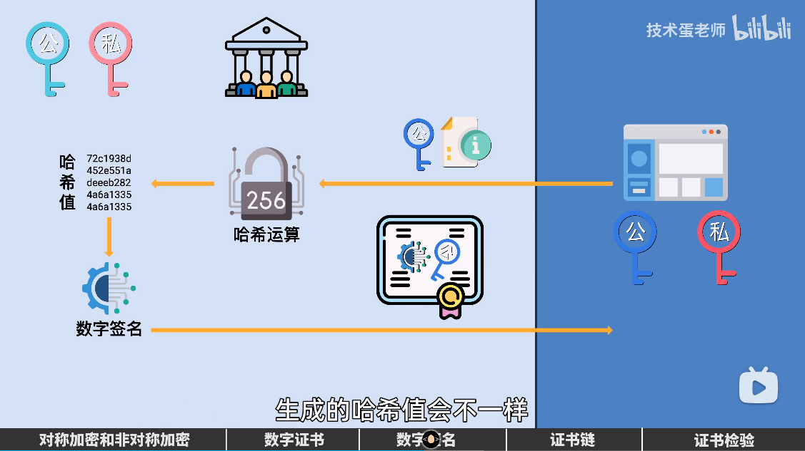
### websocket
websocket协议用于客户端和服务器之间大量互相传输消息，建立websocket连接需要在http里加上upgrade请求升级协议，客户端会发一个websocket-key给服务端，服务端收到后通过一个公开的加密算法对websocket-key进行加密再传输给客户端，客户端收到后用同样的算法对websocket加密，如果二者一致则连接建立成功
websocket的opcode用来指定这是什么类型的帧，websocket的帧是由帧长度+帧数组组成的，为了知道具体的帧数据大小，一开始会读前7个比特，如果其值在0~125，则说明第一个7bit的payload长度就够用，如果为126，那么还需要往后读16个比特的payload，如果为127，那么需要往后读64个比特的payload（16+32+16）
# Mysql
## mysql的扫描类型
All（全表扫描）；
index（全索引扫描）；
range（索引范围扫描）；
ref（非唯一索引扫描）；
eq_ref（唯一索引扫描）；
const（结果只有一条的主键或唯一索引扫描）。
执行效率依次从低到高

## mysql的优化思路
1、前缀索引优化，对记录的几个前缀建立索引，减少索引字段的大小，使一个索引页面能够容纳下更多的索引项
2、覆盖索引优化，使查询中的字段在二级索引中都能找得到，避免回表
3、主键索引最好自增，避免插入中间的键值引起页面的分裂
4、主键不应太大，否则其他的索引也会很大
5、对于需要经常排序的字段，最好对其建立索引，利用mysql本身对其排序
6、索引最好设置为NOT NULL
7、大数据量查询时limit优化，最好加上无序查询，这样可以避免数据库排序所耗费的时间

## 索引建立的原则
1、建立索引的字段区分度要高
2、针对需要经常排序的字段建立索引
3、使用前缀建立索引，一方面压缩存储空间，另一方面能够使一页索引页可以存储下更多的索引
4、尽量建立联合索引

## 索引失效的原因
1.使用了左模糊查询或者左右模糊查询
2.对索引使用了函数
3.对索引使用了表达式运算
4.索引进行了隐式类型转换 （mysql会把字符串转为其他类型，当索引为字符串时相当于把索引强转为了其他类型，建立的索引就失效了）
5、索引进行了隐式编码转换
6.联合索引进行了非最左匹配
7.使用了or时or的两侧字段没有都建立索引
8、使用not in，not exists

## Myisam和innodb引擎的区别
1.innodb支持事务，而myisam不支持
2.innodb支持外键，而myisam不支持
3.innodb是聚簇索引，其主键索引和数据是放在一起的，二级索引里存放的是主键的值；而myisam是非聚簇索引，不论是主键索引还是二级索引，存放的都是数据文件的指针
3.innodb必须有唯一索引，而myisam可以没有
4.innodb不保存表的具体行数，执行select count时需要扫描全表，这是因为innodb支持事务，不同事物看到的表的行数是不一样的；而myisam有一个全局字段保存表的行数
5.innodb支持行级锁，而myisam仅支持表级锁
## 数据库的四大特性
原子性：所有操作必须同时执行成功
数据一致性：事务操作前和操作后数据库里的数据满足完整性约束，保证一致
隔离性：多个事务可以并发的对数据库进行操作而不会相互制约
持久性：事务对数据库的改变是永久的

实现原理：原子性是通过undo log实现的，持久性是通过redo log实现的，隔离性是通过MVCC实现的，数据一致性是通过原子性+持久性+隔离性实现的

## 索引下推
对索引的判断在存储引擎完成，而不用在服务层完成
比如有语句，索引下推只对二级索引有效，因为下推的主要作用就是减少一次回表，如果是在主键索引里，就无所谓回不回表了。而且是在where有多个列条件，而且在这些列上建立了联合索引的情况下才会使用索引下推。一个例子如下：
```
select * from tuser where name like '张 %' and age=10 and ismale=1;
```
在无索引下推的时候，根据最左前缀原则，存储引擎会先定位到name为张的那些记录，然后每一条记录都会交给服务层，由服务层判断age=10成不成立
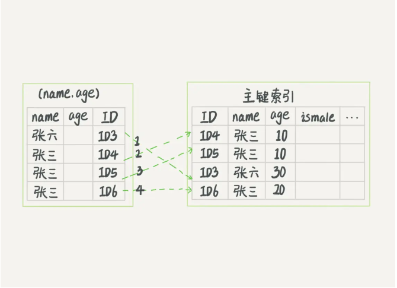
在有索引下推时，会直接在存储引擎进行条件的判断，减少回表的次数

## 聚簇索引的特点
1.唯一性：一个表中只有一个聚簇索引
2.数据物理顺序：
3.主键默认：聚簇索引默认是主键，如果没有主键，会定义一个唯一且非空的索引作为聚簇索引，如果没有这样的索引，那么会自动创建一个索引
4.快速查询：聚簇索引中包含所有所有的数据，因此可以减少一次查询，（不用回表？）
5.范围查询优化：聚簇索引中，数据按顺序排在数据页上，相同值也排在一起，因此在进行范围查询比如group by 或者 order by的时候可以不用进行大范围查询
6.覆盖索引扫描

## 慢sql
### 如何排查慢查询
1.使用慢查询日志。在MySQL配置文件中启用慢查询日志，并设置慢查询阈值(long_query_time参数)，翻看执行时间超过该值的sql语句
2.使用EXPLAIN分析查询计划，查看索引的使用情况
3.使用慢查询日志工具，如 Percona Toolkit、MySQL Enterprise Monitor等来分析慢查询
### 慢sql如何解决
先分析慢查询日志看哪些SQL查询是慢查询，然后使用EXPALIN命令分析慢查询的执行计划，分析索引使用情况。可以从**优化SQL查询语句，优化索引，避免大量数据的排序和连接操作**等方面入手
**优化SQL查询语句**：避免全表扫描，减少不必要的查询字段，使用合适的索引
**优化索引**：根据查询简历合适的索引
**避免大量数据的排序和连接操作**：可以使用分页
PS：如果是深度分页，可以在使用子查询代替，因为分页是把所有数据取出，再把不需要的丢掉，如果是 limit 100000,10 这种的，会返回100010条数据再把前100000条丢掉，因此这种情况下可以用子查询，将分页筛选转移到存储引擎层
```
# 通过子查询来获取 id 的起始值，把 limit 1000000 的条件转移到子查询
SELECT * FROM t_order WHERE id >= (SELECT id FROM t_order limit 1000000, 1) LIMIT 10;
```
还可以用延迟关联：
```
SELECT t1.* FROM t_order t1
INNER JOIN (SELECT id FROM t_order limit 1000000, 10) t2
ON t1.id = t2.id;
```
当sql和索引都没有问题时的解决思路：
1.增加缓存，将一些热点数据放到redis里
2.分表
3.在读多写少的情况下可以采用主从复制
4.分库

如何保证redis里都是热点数据：利用redis的LRU算法，选择合适的LRU算法
allkeys-lru：从所有键中选择最近最少使用的键淘汰
volatile-lru：从设置了过期时间的所有键中选择最近最少使用的键淘汰

## mysql一张表能存储多少数据
mysql一页的大小为16KB，如果一条记录的大小为1KB，那么可以存16条记录。可以存放的记录多少是由页的大小和记录大小共同决定的。**但是如果对于varchar，text这种类型的行在长度达到768byte后，会将前768byte作为前缀，多出来的数据溢出会存到溢出页中，然后通过一个偏移量指针将二者关联起来**
## sql如何分页，limit如何分页
分页使用limit实现，不同的页数根据关键字offset实现

## mysql的锁机制
从粒度大小分可以分为全局锁、表级锁和行级锁

而表级锁又可分为表锁、元数据锁、意向锁和AUTO-INC锁
表锁：可将整个表锁住，限制包括本进程在内的所有进程的读写，粒度较大，影响性能

元数据锁：自动加上的锁，进行CRUD操作时会加上MDL读锁，进行表结构改变的时候会加上MDL写锁，其中读锁和读锁之间不互斥，读锁写锁互斥并且写锁的优先级在读锁之上，当写锁阻塞时候，后续的读锁也会一起阻塞

意向锁：在对记录加上独占锁之前，需要先取得意向独占锁；在对记录加上共享锁之前，需要先取得意向共享锁。意向共享锁是用来快速判断表里是否有记录被加锁，如果没有意向锁，在给表加独占表锁时，需要遍历每一条记录，查看记录是否存在独占锁，而有了意向锁，只需要查看表里有无意向锁，这样就可以不用去遍历所有记录。

AUTO-INC锁：在插入数据时会加一个表级别的AUTO-INC锁，随后为被auto-increment修饰的字段自增1，在持有AUTO-INC锁的时候，其他事务的插入操作会被阻塞，从而保证了auto-increment修饰的字段能够正确递增。AUTO-INC锁是在语句执行完毕之后才释放的（ innodb_autoinc_lock_mode = 0），也可以设置参数 innodb_autoinc_lock_mode = 2来使申请自增后就释放锁，而不必等到语句执行完毕。但是这样存在的风险是可能使同一个会话的插入值主键不连续，从而使得主库从库不一致（从库只会执行完一个会话的插入后再执行另一个，此时是连续的），此时可以设置binlog日志的格式为row，从而使主从库的主键值一致

行级锁分为记录锁，间隙锁，和next-key锁，next-key是前两者的结合，它即锁住了一个区间，也锁住了一个点（左开右闭区间），还有插入意向锁。
插入意向锁与意向锁类似，如果记录插入位置已经被加了间隙锁，那么它会先阻塞，并在此期间生成一个插入意向锁（只是生成），并将锁设为等待状态，只有当前一个事务提交后，锁才会变为正常状态，值得注意**意向锁只是会提前生成，而不是生成之后就分配给事务。也就是说意向锁与间隙锁是互斥的，不可能一个事务持有间隙锁，一个事务持有意向锁，只有等持有间隙锁的事务提交之后，意向锁才会被分配到相应事务**
加行级锁的情况：使用锁定读
```
//对读取的记录加共享锁(S型锁)
select ... lock in share mode;

//对读取的记录加独占锁(X型锁)
select ... for update;
```
或者进行update和delete操作时会加上行级锁，加锁的基本单位是next-key锁，但是某些情况可能退化为间隙锁或者记录锁，这个要具体情况具体分析。
如果是对非唯一索引加锁，那么加锁之后能否插入二级索引值相同的记录，还要看其插入的范围，因为在锁定二级索引的同时也会锁定对应的主键。比如二级索引的间隙锁范围为（22，39），对应的主键值为10，20.那么能否插入二级索引为22，39的值得还需要看其主键的值，如果插入为（3，22）的值，那么可以插入成功，因为它不在间隙锁范围内，同理（12，22）就不能成功插入，因为它在间隙锁范围内

## mysql的五种数据类型
整型，浮点数类型，字符串类型，日期类型，二进制类型
## mysql进行范围查询时的过程
通过二分查找加载满足第一个叶子节点页到内存，在表中通过二分查找找到一一条满足要求的数据，之后通过页内链表和叶间链表不断查询，直到找到一条不满足要求的数据。
## 三种日志的关系
undolog会在语句执行前记录，redolog在语句执行完毕后就会进行对应的记录，binlog在事务执行完之后才会进行对应的记录。
事务的执行过程是：加载数据页 -> 写undolog -> 写脏页 -> 写redolog -> （事务执行完毕）-> 写binlog

## redolog和binlog是怎么保持数据一致性的

通过两阶段提交。数据库会开启一个内部事务XA，会先往redolog里写入事务的id XID，之后将redolog刷盘（**prepare阶段，此时redolog的事务状态被设置为prepare**），然后将XID写入binlog，进行binlog的刷盘，完成后，**将redolog的事务状态设置为commit**。

如果发生异常，那么会先顺序扫描redolog文件，当发现处于prepare阶段的redolog时，会去扫描binlog，如果在binlog里发现了XID，那么说明redolog和binlog都已经完成刷盘（因为扫描的是磁盘里的binlog，binlog在刷入磁盘前写入了事务号XID，如果在磁盘里扫描到了，那么说明binlog已经刷盘成功了），可以提交事务；如果没有发现XID，那么说明redolog刷盘了但是binlog没有刷盘，此时需要进行回滚

redolog是**磁盘里**的一个环形缓冲区，redologBuffer是内存里的一个缓冲区域，会采用覆盖写的形式
redolog，binlog都是磁盘里的
如果发生异常，那么会先顺序扫描redolog文件，当发现处于prepare阶段的redolog时，会去扫描binlog，如果在binlog里发现了XID，那么说明redolog和binlog都已经完成刷盘，可以提交事务(因为是在磁盘里扫描的binlog，binlog在刷盘前会写入XID，如果在磁盘里发现了XID，说明binlog已经刷盘成功了)；如果没有发现XID，那么说明redolog刷盘了但是binlog没有刷盘，此时需要进行回滚

redolog是磁盘里的一个环形缓冲区，是可覆盖的写binlog空间不够会开新页

## 各种刷盘时机比较
### redolog
MySQL 正常关闭时；

当 redo log buffer 中记录的写入量大于redo log buffer内存空间的一半时，会触发落盘；

InnoDB 的后台线程每隔 1 秒，将 redo log buffer 持久化到磁盘。

每次事务提交时都将缓存在redo log buffer里的redo log直接持久化到磁盘，这个策略可由 innodb_flush_log_at_trx_commit 参数控制，

当设置该参数为0时，表示每次事务提交时，还是将redo log留在redo log buffer中 ，该模式下在事务提交时不会主动触发写入磁盘的操作。
当设置该参数为1时，表示每次事务提交时，都将缓存在redo log buffer里的redo log直接持久化到磁盘，这样可以保证MySQL异常重启之后数据不会丢失。
当设置该参数为2时，表示每次事务提交时，都只是缓存在redo log buffer里的redo log写到redo log文件，注意写入到「redo log 文件」并不意味着写入到了磁盘，因为操作系统的文件系统中有个 Page Cache，Page Cache 是专门用来缓存文件数据的，所以写入「redo log文件」意味着写入到了操作系统的文件缓存。
### binlog
MySQL提供一个 sync_binlog 参数来控制数据库的binlog刷到磁盘上的频率：

sync_binlog=0的时候，表示每次提交事务都只write，不fsync，后续交由操作系统决定何时将数据持久化到磁盘；
sync_binlog=1的时候，表示每次提交事务都会write，然后马上执行fsync；
sync_binlog =N(N>1)的时候，表示每次提交事务都write，但累积N个事务后才fsync。

### AOF
在 redis.conf配置文件中的appendfsync配置项可以有以下 3 种参数可填：

Always，这个单词的意思是「总是」，所以它的意思是每次写操作命令执行完后，同步将AOF日志数据写回硬盘；

Everysec，这个单词的意思是「每秒」，所以它的意思是每次写操作命令执行完后，先将命令写入到 AOF 文件的内核缓冲区，然后每隔一秒将缓冲区里的内容写回到硬盘；

No，意味着不由Redis控制写回硬盘的时机，转交给操作系统控制写回的时机，也就是每次写操作命令执行完后，先将命令写入到 AOF 文件的内核缓冲区，再由操作系统决定何时将缓冲区内容写回硬盘。

## 主从延迟
主从延迟主要来自三个部分：
主库执行完一个事务，写入 binlog，将这个时刻记为 T1；
从库 I/O 线程接收到 binlog 并写入 relay log 的时刻记为 T2；
从库 SQL 线程读取 relay log 同步数据本地的时刻记为 T3。

解决方法：从从库的角度：1、提升从库机器性能
2、减少网络延迟
3、减少大事务
4、从库上的读太多，占用了太多资源，增加从库数量
从主库的角度：1、从库太多会使主库到从库的传输压力变大，针对这种情况，可以增加从库数量，或是将从库分层，由下一级从库向更下一级的从库进行同步

## MySQL和Redis如何保证主从一致性的
MySQL：
通过binlog的方式实现主从复制，同时依据主从复制时使用的不同主从复制模型实现不同等级的主从一致性：
以下方式主从一致依次降低：
1、同步复制，主库提交事务后，必须同步到所有的从库，等待所有从库响应后才返回客户端结果。这种情况主从一致性最强，但是要求最高。
2、异步复制，主库不必等到从库响应成功就可以返回给客户端结果，这种情况主从一致性最弱，但是要求最低，可能存在主库宕机导致数据丢失的情况
3、半同步复制，主库等到部分从库响应成功后就可以返回给客户端结果，这种情况下就算主库宕机，因为还有部分从库有数据，可以保证数据不丢失。

Redis：
Redis通过主从库保持长连接进行命令传播的方式来保证主从数据一致性，主库的数据更新后也会通过这个连接传递的从库。如果网络波动导致连接断开，待连接恢复后会进行增量复制：数据存在一个环形缓冲区replication buffer，主从进行命令传播时，除了写入从库，也会写入replication buffer，主从库都存有对应的replication buffer偏移量指针，主库记录【写】到哪里了，从库记录【读】到哪里了。当主从连接恢复后，从库会根据主库和从库的指针位置之差来判断进行什么操作，如果判断出数据还在缓冲区内，那么回进行**增量同步**，如果判断出数据已经被覆盖了，那么会采用**全量同步**，跟第一次同步一样，主库将RDB文件发给从库进行同步


# 分布式
## 分布式id生成方法
1.数据库主键自增
2.数据库号段分配
3.uuid算法
4.雪花算法

## 为什么用RPC不用HTTP
HTTP中对于服务调用来说有太多冗余信息，比如头部规范的字段等等，这些冗余信息会拖慢传输的速度，RPC可以基于TCP自定义传输格式，可以只关注自己想要的数据。除此之外，一些好的RPC框架还支持自动服务注册与发现，智能负载均衡等

## 负载均衡
### 不同的负载均衡方向
客户端负载均衡：
客户端会自己维护一份服务器地址列表，发送请求前，客户端会根据负载均衡算法选择一台具体的服务器处理请求

服务端负载均衡：
通常由一层、两层、四层、七层负载均衡
其中四层和七层最常见，四层工作在传输层，七层工作在应用层
七层负载均衡常见的两种有：**DNS解析、反向代理**
**DNS解析指的是**在DNS服务器中为同一个主机域名配置多个IP地址，这些IP地址对应了不同的服务器，用户请求解析域名时，根据轮询的方式返回一个IP地址
**反向代理**指的是用一个反向代理服务器来处理客户端的请求，由反向代理服务器来选择具体的服务器处理请求并返回给客户端结果。由于反向代理服务器此时是代替服务器进行请求处理，相当于把服务器隐藏了，因此称之为”反向代理“。与之相对的是正向代理，是指代理服务器代替客户端发送请求，此时对于服务端而言客户端被隐藏了，因此被称为正向代理。

### 负载均衡常见的算法
**1.随机法**
随机选择一个服务器进行服务，但是可能存在某些服务器空闲时间过久的弊端
**2.轮询法**
按照次序依次询问服务器，分为**加权轮询和不加权轮询**，不加权轮询指的是每个服务器都会按照次序逐一被分配请求，适合每个服务器负载能力相同的服务器集群；加权轮询指的是给某些负载能力较强的服务器赋予较大的权重，以使得它们能分配到更多请求
**3.两次随机法**
跟随机法类似，只不过是选出两个随机的服务器，从中选择一个
**4.哈希法**
通过哈希函数映射到服务器上，弊端是当有服务器变动时哈希结果会变化，造成大规模的数据迁移
**5.一致性哈希**
将服务器节点遍布在一个固定的圆盘上，这样就算有服务器变动，受影响的也只有变更服务器的顺时针上的下一个服务。而且可以通过添加虚拟节点的方式使负载更加均衡
**6.最小连接法**
选择连接数最少的服务器，但是连接数少不一定代表负载小，可能某些连接负载会很大
**7.最少活跃法**
和最小连接法类似，只不过最少连接法选择的是**活动最小连接数**最少的服务器
**8.最快响应法**
客户端会维持每个服务器的响应时间，会从中选择一个响应事件最短的服务器

# Seckill秒杀系统
## 项目难点
1.短时间内大量用户访问，高并发情况下缓解服务器压力
    动静分离，redis库存预减，MQ流量削峰；秒杀地址隐藏，接口限流
2.高并发的情况下超卖的问题
select -> 判断 -> 扣减 超卖发生
mysql -> update加排他锁
redis -> 使用lua脚本将读库存和扣减库存变为一个原子操作，使得redis里的库存也不超卖
对redis里的库存做内存标记，减少redis的访问
## 流程
登录获取cookie——以cookie为键，用户信息为值放入redis以便后续获取——查询缓存——预减库存——发送到MQ——订单生成模块处理MQ消息

## redis缓存页面+页面动静分离
redis缓存页面指将一些不会变的页面提前渲染好存入redis中，之后用户请求时直接返回该页面即可，这样当再次访问该页面时，**总是直接返回redis中的数据，而不必每次都要从数据库读取信息**，降低了数据库的读取压力

页面动静分离指将一些页面采用前后端分离的模式作为静态页面，前端请求时只需要请求一些需要填充的数据，**请求到数据之后就可以用本地的静态页面缓存+数据渲染页面，而不用每次都请求一整个页面**，通过ajax请求模拟

## 读多写少场景下redis的优化
可以使用读写分离的架构，先从从节点里读取库存，如果够，那么向主节点中读取并写入(如果库存够)，之后再进行主从同步
## 保证redis缓存一致性
采用旁路缓存策略，读的时候先读缓存，缓存中不存在则读数据库并写入缓存；写的时候先写数据库，再删除缓存。

写的时候如果先删缓存，再更新数据库，此时为了防止不一致，可以采用延迟双删策略(延迟双删的时候可以用线程池删除)，如果删除失败，那么可以1.将要删除的key放入消息队列中，自己作为消费者从消息队列中获得消息(要删除的key)，再次进行删除，直到删除成功。或者2.读取数据库binlog，从binlog中获取相应的要删除的key再进行删除

## 解决库存超卖问题
单纯在减库存时判断商品库存是否为负，为负不再继续，解决超卖。
```
boolean seckillGoodsResult = itSeckillGoodsService.update(new UpdateWrapper<TSeckillGoods>()
.setSql("stock_count = " + "stock_count-1")
.eq("goods_id", goodsVo.getId())
.gt("stock_count", 0)
);
if (!seckillGoodsResult) {
    return null;
}
```

另外的方案：加Redisson分布式锁 或者 查询库存时使用 for update进行加锁

## 减少sql访问
1.通过redis库存预减减少对mysql的访问
redis库存预减必须实现原子性，不然可能会导致redis缓存中的库存发生超卖的现象，超卖的订单还是会走数据库，加大数据库压力。这里是通过redis+Lua脚本实现的
为什么Lua可以实现防止redis缓存中的库存发生超卖：如果有很多个请求同时执行 Lua 脚本，Redis 会依次执行这些请求，确保每个 Lua 脚本的原子性。**当一个 Lua 脚本执行完毕后，才会去执行下一个 Lua 脚本**，这样可以保证每个 Lua 脚本的操作都是原子的，不会被其他请求打断。由于每一个秒杀请求读取库存和扣减库存都是在Lua脚本里执行的，因此不会出现多个请求读取到同一个库存数然后递减导致的库存超卖问题

2.通过内存标记减少对redis的访问

## 解决重复抢购问题
这里的幂等性定义为下过单以后无论多少次点击也无法重复下单
1.通过读取缓存订单
2.对秒杀订单简历id+商品id的唯一索引，在生成订单前开启事务，如果存在相同索引订单会抛出异常，造成事务的回滚

## 如何解决少卖问题
当同一个用户重复下单，当还没有生成订单的时候，每一次下单Redis库存就会减少一个，那么当mysql中订单重复的时，mysql会回滚，但是redis已经扣减的库存不会回滚，后面的请求订单因为redis中库存不足也无法成功下单，就造成了mysql中的库存会卖不完，造成少卖现象。这种情况可以将redis中的库存多设置一点，比如说库存有10个，那么redis里面的库存可以设置为20个，一定程度上可以减少少买现象的发生

https://www.cnblogs.com/xiangkejin/p/9351501.html 关于秒杀优化总结的一篇博文

## 如果一个用户可以秒杀多件怎么办
1.加一个分布式锁
# Linux
查看cpu使用率：1.top   2.cat /proc/loadavg

查看内存:free

查看日志:tail,往后看多少日志，例如
tail  -n  10   test.log   查询日志尾部最后10行的日志;
tail  -n +10   test.log   查询10行之后的所有日志;
tail  -fn 10   test.log   循环实时查看最后10行记录(最常用的)
一般还会配合grep一起用，比如  tail -fn 1000 test.log | grep '关键字'
如果想要翻页查看，那么使用more：tail -n 4700  aa.log |more -1000 可以进行多屏显示(ctrl + f 或者 空格键可以快捷键)

head，于tail相反，往前看
head -n  10  test.log   查询日志文件中的头10行日志;
head -n -10  test.log   查询日志文件除了最后10行的其他所有日志;

less,与more类似，但是比more更加灵活，可以向上向下翻页
一般的查找流程：
less log.log
shift + G 命令到文件尾部  然后输入 ？加上你要搜索的关键字例如 ？1213
按 n 向上查找关键字
shift+n  反向查找关键字


查找关键字:grep

报告进程：ps(ps -ef|grep xxx)

查看所有进程：top
ps的输出是静态的，只会显示当前时刻的进程信息；top的输出是动态的，可以实时显示系统中进程的cpu占用、内存占用等情况

# OS
## 进程与线程区别
本质区别：进程是操作系统资源分配的基本单位，而线程是任务调度和执行的基本单位

在开销方面：每个进程都有独立的代码和数据空间（程序上下文），程序之间的切换会有较大的开销；线程可以看做轻量级的进程，同一类线程共享代码和数据空间，每个线程都有自己独立的运行栈和程序计数器（PC），线程之间切换的开销小

稳定性方面：进程中某个线程如果崩溃了，可能会导致整个进程都崩溃。而进程中的子进程崩溃，并不会影响其他进程。

内存分配方面：系统在运行的时候会为每个进程分配不同的内存空间；而对线程而言，除了CPU外，系统不会为线程分配内存（线程所使用的资源来自其所属进程的资源），线程组之间只能共享资源

包含关系：没有线程的进程可以看做是单线程的，如果一个进程内有多个线程，则执行过程不是一条线的，而是多条线（线程）共同完成的；线程是进程的一部分，所以线程也被称为轻权进程或者轻量级进程
## 零拷贝
零拷贝指的是减少数据在缓冲区之间的拷贝次数以及系统调用的次数。

传统模式下：发起read调用，DMA拷贝到内核缓冲区，CPU将内核缓冲区内容拷贝到用户空间；发起write调用，CPU将用户空间拷贝到socket缓冲区，DMA将socket缓冲区内容拷贝到网卡。会进行**4次拷贝，2次系统调用，4次上下文切换**

mmap+write：发起read调用，DMA拷贝到内核缓冲区，此时，**应用程序和内核共享这个缓冲区**，之后发起write调用，会将内容从内核缓冲区拷贝到socket缓冲区(CPU)，DMA将socket缓冲区拷贝到网卡，会进行**3次拷贝，2次系统调用，4次上下文切换**

sendfile：发起sendfile调用，DMA拷贝到内核缓冲区，**内核缓冲区会拷贝到socket缓冲区(CPU)**，DMA将socket缓冲区内容拷贝到网卡，会进行**3次拷贝，1系统调用，2次上下文切换**

在支持SG-DMA的条件下的sendfile：发起sendfile调用，DMA拷贝到内核缓冲区，**之后DMA会直接把内核缓冲区内容拷贝到网卡里，而不需要拷贝到socket缓冲区**，会进行**2次拷贝，1次系统调用，2次上下文切换**,并且全程只需要DMA拷贝
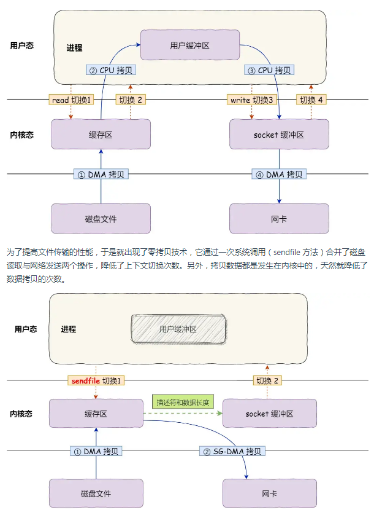

## NIO
NIO指的是非阻塞IO，与之对应的是阻塞IO BIO。BIO指的是线程在发出IO调用以后会进入阻塞状态，直到IO完成，BIO指的是线程发出IO调用以后线程不会阻塞，而是采用轮询的方式查看IO是否完成，**BIO在内核准备好数据后将其拷入用户空间时还是会阻塞**。还有一种方式是异步IO，指的是线程调用以后就立刻返回，等待IO完成以后再进行数据处理，不会有阻塞

IO多路复用指的是一个线程可以处理多个IO请求。最常见的方式有select，poll和epoll。**其中select和poll都是采用的将所有已连接socket放进一个文件描述符集合，拷贝进内核，让内核通过遍历的方式检查有无IO事件发生并标记**，检查完以后会**重新拷贝回用户态，同样通过遍历的方式找到可读或者可写的socket**。
epoll在内核中维护了一个**socket红黑树**，每次只需要把待检测的socket复制到内核，而不用把所有socket描述符都复制到内核，并且会有一个**就绪事件链表，每当有事件产生时就会将socket复制到链表中**。当用户调用epoll_wait()时，只会返回就绪的事件个数而不用轮询遍历。epoll的封装主要有Reactor模式


epoll的封装主要有Reactor模式


Java中的NIO通常是指由buffer，channel，selector组成的IO模型。Buffer是缓冲区，它与Channel之间双向连接，当进行读操作时会从Channel写到Buffer，写操作时会从Buffer写到Channnel。
Channel是建立了与数据源（如文件、网络套接字等）之间的连接，它会注册到Selector，由Selector进行事件监听

Selector 是基于事件驱动的 I/O 多路复用模型(**也就是前面说的Reactor**)，主要运作原理是：通过 Selector 注册通道的事件，Selector 会不断地轮询注册在其上的 Channel。当事件发生时，比如：某个 Channel 上面有新的 TCP 连接接入、读和写事件，这个 Channel 就处于就绪状态，会被 Selector 轮询出来。Selector 会将相关的 Channel 加入到就绪集合中。通过 SelectionKey 可以获取就绪 Channel 的集合，然后对这些就绪的 Channel 进行响应的 I/O 操作。

## 线程通信的方式
1.volatile关键字
2.wait/notify
3.condition的signal/await
4.join
## 什么是协程
## 僵尸线程和孤儿线程
僵尸进程：一个进程使用fork创建子进程，**子进程退出**，但是父进程并没有调用wait或waitpid获取子进程的状态信息，那么子进程的进程描述符仍然保存在系统中（会占用进程号之类，还有占用的内存）

孤儿进程：**一个父进程退出**，但它的一个或多个子进程还在运行，那么这些子进程将成为孤儿进程。孤儿进程将被init进程(进程号为1)所收养，并由init进程对它们完成状态收集工作。
## MESI协议和内存屏障
MESI缓存一致性协议主要是为了除了多核cpu内缓存不一致的情况，比如
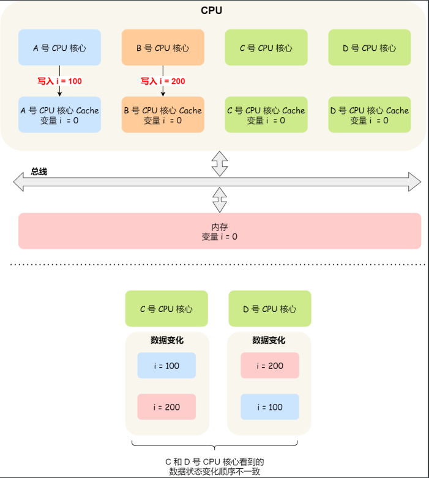
C先看到A的变化，后看到B的变化，于是最后i=200；D先看到B的变化，后看到A的变化，于是最后i=100.造成了变量在不同缓存之间的不一致
MESI协议可以有效解决缓存一致性问题，它有四个状态：
Modified：已修改
Exclusive：独占
Shared：共享
Invalidated：失效
下面这个例子用来说明他们之间的变化已经是如何解决一致性问题的

初始有3块CPU,分别为A,B,C
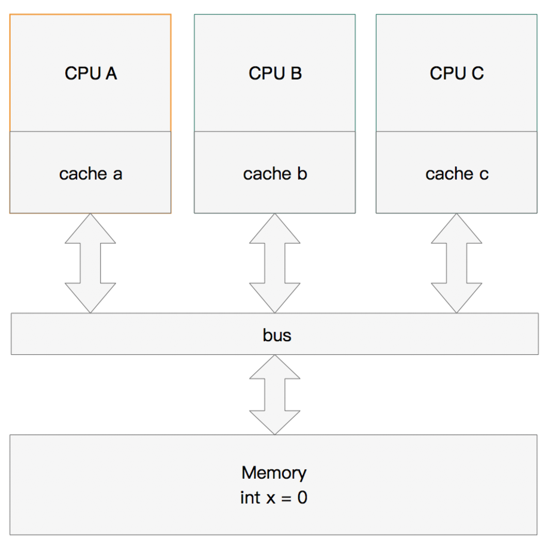
A先从内存中读取变量X，此时它对变量X的状态为E，在E状态下，可以随意修改数据（修改后状态变为M），因为只有它自己持有数据

接着B也需要从内存中读取变量X，A会接收到B的信号，会将它的数据返回给B。此时A,B的状态都变为S，并且此时A,B的数据都是和内存一致的(因为是从A的E状态转换来的，此时A的缓存和内存中数据一致)

当A需要修改数据时，会向**所有其余的CPU**传递信号，将他们的状态变为I（如果C也有共享的话，C的状态也会变为I），只会A会更新数据，同时将它的状态设为M
需要注意的是，如果之后A还要再次更新数据，那么直接更新即可，不必再向其余的CPU发送消息
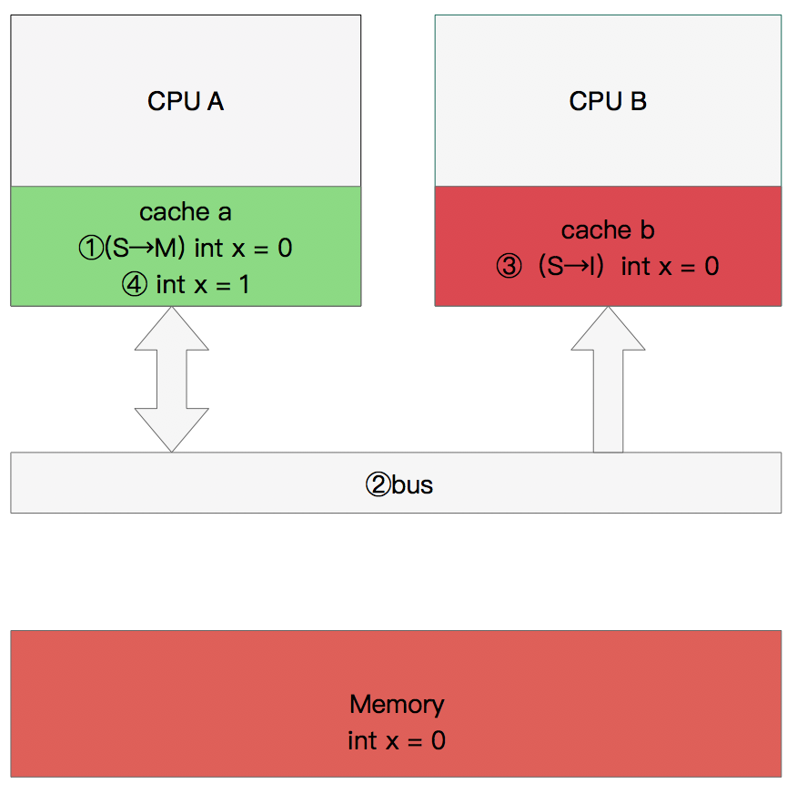
B想要读取数据时，会先通知A，A将其数据写到内存中，同时同步到B中，同时A会通知B（如果有其他的CPU也会通知其他的CPU）将其状态修改为S，其本身状态也会修改为S
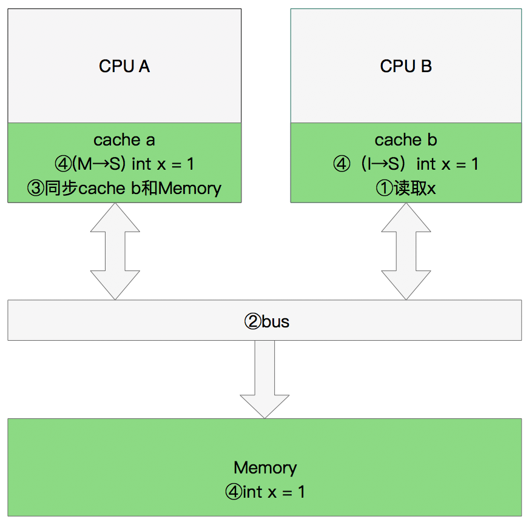
四个状态的转换图如下


完全遵守MESI会影响cpu利用率，因为A**每次修改变量后都需要等到B对该变量已修改为I的ack**才能完成对变量的更新。因此，引入了一个**存储队列Store Buffer**，A在修改变量之后会直接扔到存储队列里，由存储队列接受B的ack，接收到B的ack以后，存储队列里的变量就会写回A的缓冲区。但存储队列的容量很小，如果存储队列满了，那么A又会恢复到等待B的ack。因此，又引入了一个**失效队列InvalidQueue**，A只需要把被修改的变量(也就是对B而言的失效消息)放进**A存储队列，再由A存储队列放到B的失效队列**中，就可以得到B的ack而不用等待。B在空闲的时候就会去消耗它失效队列里面的消息。
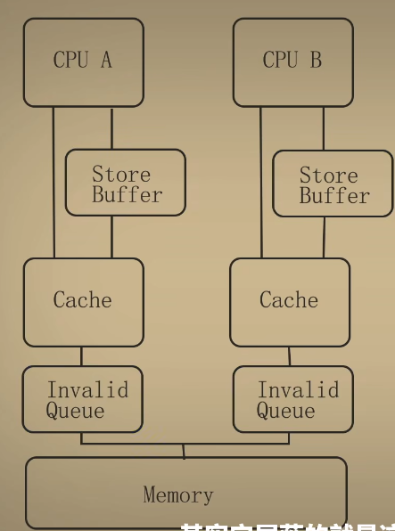
常说的指令重排和cpu乱序执行**有时候**(还有编译器优化的原因)就是因为这两个队列的原因，比如说，有两条语句，先修改D，再修改C。但是C先收到ack，D后收到ack，这样看起来就像是C和D执行顺序颠倒了一样

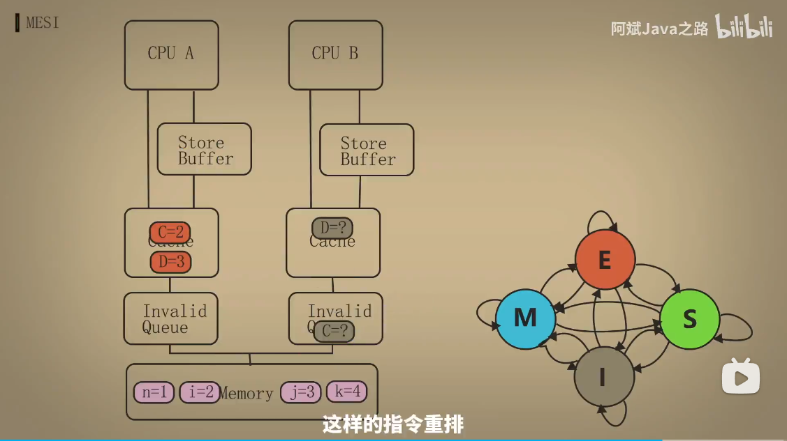
**那么，什么是内存屏障？**
内存屏障也跟上面提到的两个队列有关系，内存屏障分为**读屏障和写屏障**，
其中，在写操作之后加入写屏障，可以保证存储队列里的消息全部被写入到对方cpu的失效队列中，读操作之前加入读屏障，可以保证失效队列中的消息都被消费完

# 实习
## 逆向四期
可能存在司机觉得商品损坏，或者找不到商品条码的情况不带回
根据用户的退款原因分，如果不是七天无理由，那么此时无论商品是否有损，都需要取回，之后再交由其他同事审核
如果用户的退款理由是七天无理由退款，那么此时无论怎样都需要给用户退，所以这时候会提示司机一些不需要取回的情况：商品损坏/商品无条码；
这样的话就可以让司机更好的知道什么情况下货物都需要取回、什么情况下不需要取回

司机找商品时：如果团长确认收货，那么展示团长确认收货的照片，便于司机找寻退回商品；
在司机和团长有通话的情况下，司机在选择和团长有关的无法取回的原因时，比如团长未收到货，通话录音会记录到单据，并且司机无需额外的视频证据

单据导出量由5000提升至30000：引入导出组件，前段请求先打到该组件上，然后经过其处理模块处理调用相关rpc接口进行处理，之后将处理结果上传至美团云，再经由集团文件分发平台分发文件下载url

## 项目有哪些难点
难点：在查配送单的时候，因为数量大，mysql扫描行数巨大，导致慢查询，因此先查运单，再经由运单插配送单，这样相当于在业务层面对配送单进行了一层过滤