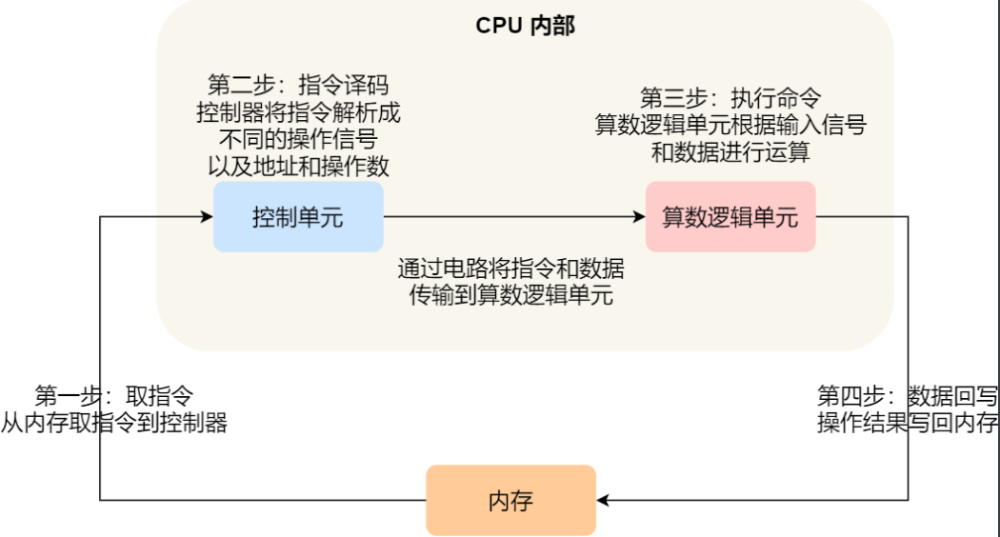
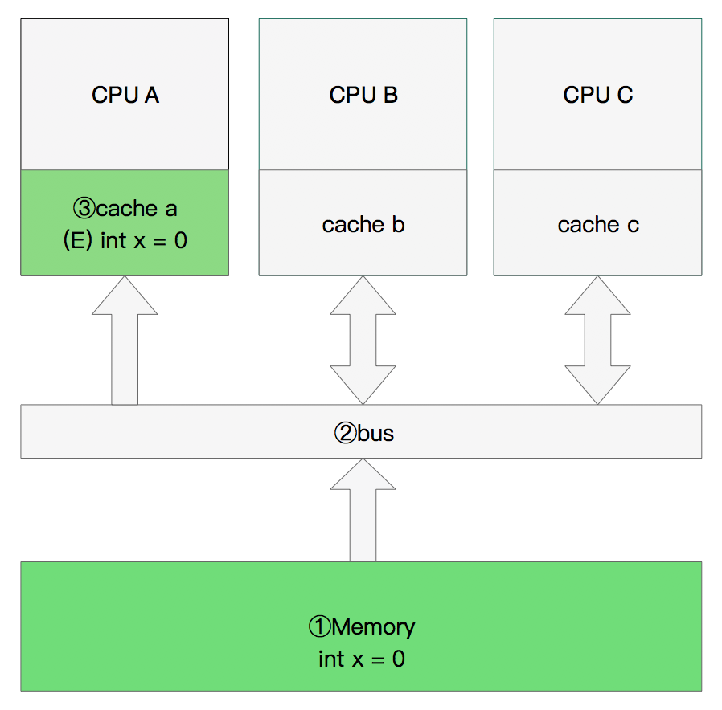
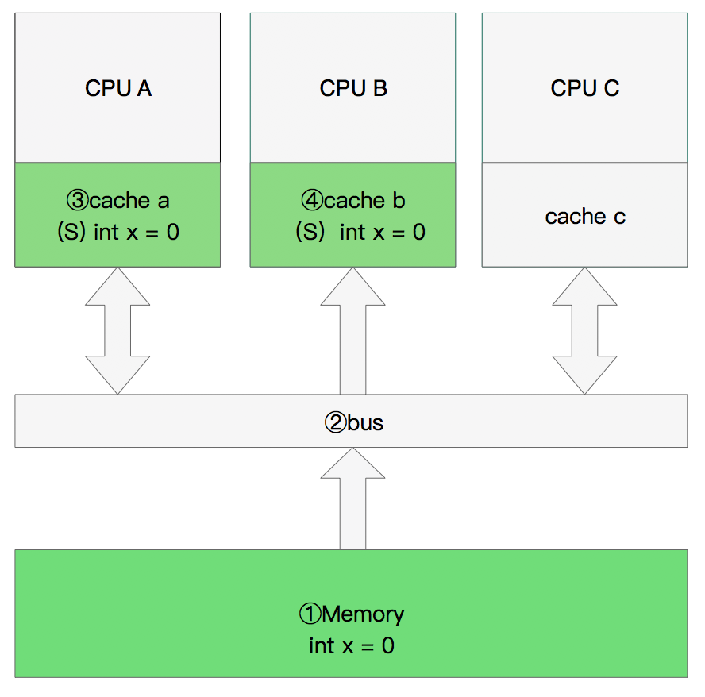

# 计算机结构

## cpu
cpu除了有数据位，还有控制单元，逻辑运算单元，以及寄存器。
控制单元负责控制cpu工作，
逻辑运算单元负责计算，
寄存器在cpu里，紧挨控制单元和逻辑单元，运算速度快
大致分为三种：
通用寄存器：存放运算时所需要的数据
程序计数器：存放下一条指令的**地址**
指令寄存器：存放下一条指令
## 总线
总线用于cpu和内存或者其他设备之间的通信，可分为3种：
地址总线：用于指定cpu将要操作的内存地址
数据总线：用于读写内存的数据
控制总线：用于发送和接收信号，比如中断，复位等

cpu的位宽指的是cpu一次能计算多少个字节，比如32位cpu一次可以计算4个字节，64位cpu一次可以计算8个字节。
线路位宽指的是通过地址总线一次能寻到多少地址，比如只有一条地址总线，那么一次寻址最多可以找到0，1两个位置，如果有32条地址总线，那么一次能寻址到的数目为$2^{32}=2^{10}(K) * 2^{10}(M) * 2^{10}(G) * 2^{2} = 4G$。
因为32位 CPU ⼀次最多只能操作 32 位宽的地址总线和数据总线，因此为了使得工作复杂和麻烦，cpu的位宽最好不要小于线路位宽。
32位cpu最大只能操作4G内存，因此在这种情况下装8G内存条也是没用的
## cpu执行程序的过程
1.取地址：cpu读取程序计数器里下一条指令的地址，控制单元控制cpu通过地址总线访问相应内存地址，并通知内存做好读取准备，之后通过数据总线将该指令数据存入指令寄存器当中
2.执行指令：cpu分析指令寄存器里的指令类型，如果是计算类型的指令则将指令交给逻辑运算单元进行处理，如果是存储类型的指令则交给控制单元处理
3.指向下一条指令：程序计数器自增1，指向下一条指令。自增大小又cpu位宽决定，如cpu位宽为32位，那么指令是4个字节，会占4个存储单元，因此程序计数器会自增4

cpu执行程序的四个阶段如上图，**Fetch**通过**控制器**在内存中取得指令，**Decode**阶段通过**控制器**对指令进行解码，**Execute**阶段执行取得的指令，如果是简单的**无条件地址跳转**则在**控制单元**里进行，其余的诸如算术操作，逻辑操作，或是数据传输，条件分支操作都是在**算术逻辑单元**内进行,具体如下图

## 指令执行速度
**程序cpu执行时间=cpu时钟周期数×时钟周期时间=指令数×CPI×时钟周期时间**
时钟周期时间指的是每一次脉冲信号的高低电平转换时间，比如一个1GHz的cpu，指的是它的时钟频率为1G，代表1s会产生1G次数脉冲信号，每一次脉冲信号的高低电平转换时间为1/1G，这就是一个时钟周期时间。在一个时钟周期时间内，cpu仅能完成一次动作，因此时钟频率越高，其时钟周期越短，cpu执行速度越快。当然，有些指令是不能在一个时钟周期内就执行完毕的
指令数指的是执行程序需要哪几条指令，需要多少指令，这个需要通过编译器进行优化
CPI代表每条指令的平均时钟周期数，指一条指令需要多少个时钟周期，这个通过CPU流水线技术使CPU时钟周期数尽可能少
## MESI缓存一致性协议
MESI缓存一致性协议主要是为了除了多核cpu内缓存不一致的情况，比如

C先看到A的变化，后看到B的变化，于是最后i=200；D先看到B的变化，后看到A的变化，于是最后i=100.造成了变量在不同缓存之间的不一致
MESI协议可以有效解决缓存一致性问题，它有四个状态：
Modified：已修改
Exclusive：独占
Shared：共享
Invalidated：失效
下面这个例子用来说明他们之间的变化已经是如何解决一致性问题的

初始有3块CPU,分别为A,B,C

A先从内存中读取变量X，此时它对变量X的状态为E，在E状态下，可以随意修改数据（修改后状态变为M），因为只有它自己持有数据

接着B也需要从内存中读取变量X，A会接收到B的信号，会将它的数据返回给B。此时A,B的状态都变为S，并且此时A,B的数据都是和内存一致的(因为是从A的E状态转换来的，此时A的缓存和内存中数据一致)

当A需要修改数据时，会向**所有其余的CPU**传递信号，将他们的状态变为I（如果C也有共享的话，C的状态也会变为I），只会A会更新数据，同时将它的状态设为M
需要注意的是，如果之后A还要再次更新数据，那么直接更新即可，不必再向其余的CPU发送消息

B想要读取数据时，会先通知A，A将其数据写到内存中，同时同步到B中，同时A会通知B（如果有其他的CPU也会通知其他的CPU）将其状态修改为S，其本身状态也会修改为S

四个状态的转换图如下

### 零拷贝
零拷贝指的是减少数据在缓冲区之间的拷贝次数以及系统调用的次数。

传统模式下：发起read调用，DMA拷贝到内核缓冲区，CPU将内核缓冲区内容拷贝到用户空间；发起write调用，CPU将用户空间拷贝到socket缓冲区，DMA将socket缓冲区内容拷贝到网卡。会进行**4次拷贝，2次系统调用，4次上下文切换**

mmap+write：发起read调用，DMA拷贝到内核缓冲区，此时，**应用程序和内核共享这个缓冲区**，之后发起write调用，会将内容从内核缓冲区拷贝到socket缓冲区(CPU)，DMA将socket缓冲区拷贝到网卡，会进行**3次拷贝，2次系统调用，4次上下文切换**

sendfile：发起sendfile调用，DMA拷贝到内核缓冲区，**内核缓冲区会拷贝到socket缓冲区(CPU)**，DMA将socket缓冲区内容拷贝到网卡，会进行**3次拷贝，1系统调用，2次上下文切换**

在支持SG-DMA的条件下的sendfile：发起sendfile调用，DMA拷贝到内核缓冲区，**之后DMA会直接把内核缓冲区内容拷贝到网卡里，而不需要拷贝到socket缓冲区**，会进行**2次拷贝，1次系统调用，2次上下文切换**,并且全程只需要DMA拷贝
### NIO
NIO指的是非阻塞IO，与之对应的是阻塞IO BIO。BIO指的是线程在发出IO调用以后会进入阻塞状态，直到IO完成，BIO指的是线程发出IO调用以后线程不会阻塞，而是采用轮询的方式查看IO是否完成，**BIO在内核准备好数据后将其拷入用户空间时还是会阻塞**。还有一种方式是异步IO，指的是线程调用以后就立刻返回，等待IO完成以后再进行数据处理，不会有阻塞

IO多路复用指的是一个线程可以处理多个IO请求。最常见的方式有select，poll和epoll。**其中select和poll都是采用的将所有已连接socket放进一个文件描述符集合，拷贝进内核，让内核通过遍历的方式检查有无IO事件发生并标记**，检查完以后会**重新拷贝回用户态，同样通过遍历的方式找到可读或者可写的socket**。
epoll在内核中维护了一个**socket红黑树**，每次只需要把待检测的socket复制到内核，而不用把所有socket描述符都复制到内核，并且会有一个**就绪事件链表，每当有事件产生时就会将socket复制到链表中**。当用户调用epoll_wait()时，只会返回就绪的事件个数而不用轮询遍历。epoll的封装主要有Reactor模式

epoll的封装主要有Reactor模式

Java中的NIO通常是指由buffer，channel，selector组成的IO模型。Buffer是缓冲区，它与Channel之间双向连接，当进行读操作时会从Channel写到Buffer，写操作时会从Buffer写到Channnel。
Channel是建立了与数据源（如文件、网络套接字等）之间的连接，它会注册到Selector，由Selector进行事件监听

Selector 是基于事件驱动的 I/O 多路复用模型(**也就是前面说的Reactor**)，主要运作原理是：通过 Selector 注册通道的事件，Selector 会不断地轮询注册在其上的 Channel。当事件发生时，比如：某个 Channel 上面有新的 TCP 连接接入、读和写事件，这个 Channel 就处于就绪状态，会被 Selector 轮询出来。Selector 会将相关的 Channel 加入到就绪集合中。通过 SelectionKey 可以获取就绪 Channel 的集合，然后对这些就绪的 Channel 进行响应的 I/O 操作。

### 线程通信的方式
1.volatile关键字
2.wait/notify
3.condition的signal/await
4.join